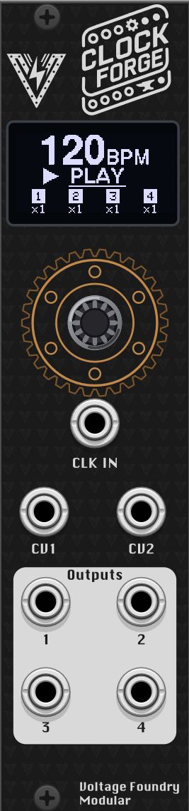
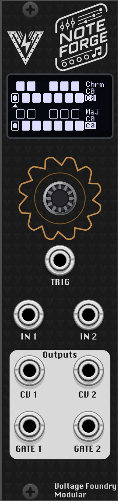
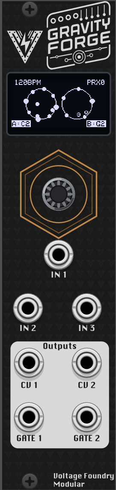
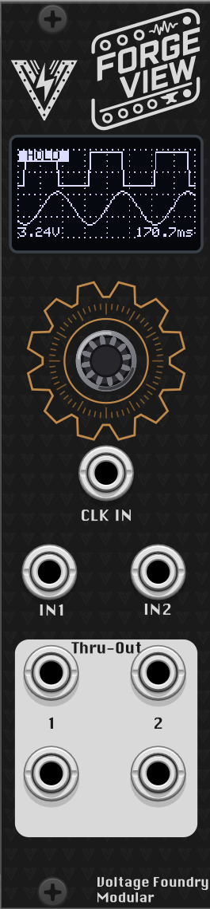

<div align="center">


# ForgeSeries

**One open-source Eurorack platform. Many modules. You choose which one it is at
power-on — and the same firmware also runs inside VCV Rack.**

[The modules](#the-modules) ·
[Get one running](#get-one-running) ·
[The board](#the-board) ·
[Building from source](#building) ·
[How it fits together](#how-it-fits-together)

[Website & manuals](https://vfmod.com) ·
[Hardware repo](https://github.com/VoltageFoundryMod/ForgeSeries-Hardware) ·
[Firmware releases](https://github.com/VoltageFoundryMod/ForgeSeries/releases) ·
[Support on Patreon](https://patreon.com/carlosedp)

</div>

---

## What this is

ForgeSeries is a family of 6HP Eurorack modules from **Voltage Foundry Modular**
that all share a single board: a Seeed XIAO RP2040, a 128×64 OLED, one encoder,
3 CV inputs and 4 outputs. What makes the board a clock generator or a quantizer
is nothing but firmware.

This repository holds all of it:

- **The firmware** — one image (`src/`) that contains _every_ module. Hold
  the encoder at power-on to pick which one boots; the choice persists.
- **The VCV Rack plugin** — not a reimplementation. The actual firmware runs
  inside Rack against a hardware shim, with the OLED emulated pixel for pixel,
  so a patch behaves the same on the metal and on the screen.
- **The shared core** — board bring-up, CV calibration, storage, display and
  menu plumbing that every module builds on.

Schematics, PCB and panel files are open too, in the separate
[ForgeSeries-Hardware](https://github.com/VoltageFoundryMod/ForgeSeries-Hardware)
repository.

## The modules

|                                                                                 | Module                                    | What it does                                                                                                                                                                                                      | Docs                                                                                                                                                                                                       |
| ------------------------------------------------------------------------------- | ----------------------------------------- | ----------------------------------------------------------------------------------------------------------------------------------------------------------------------------------------------------------------- | ---------------------------------------------------------------------------------------------------------------------------------------------------------------------------------------------------------- |
|    | **ClockForge**<br><sub>`apps/clk`</sub>   | Clock generator and modulation source. Four outputs with individual multiply/divide, waveforms, envelopes, Euclidean rhythms, swing, phase, probability, cross-operations and loops. Tap tempo and external sync. | [Overview](apps/clk/Readme.md) · [Manual](apps/clk/Manual.md) · [VCV port](apps/clk/docs/VCVRack_Plugin.md) · [ModularGrid](https://modulargrid.net/e/other-unknown-clockforge-by-voltage-foundry-modular) |
|      | **NoteForge**<br><sub>`apps/dq`</sub>     | Dual quantizer. Two independent channels, each with its own editable 12-note scale mask, octave shift, glide, sample & hold and a gate/envelope output.                                                           | [Overview](apps/dq/Readme.md) · [Manual](apps/dq/Manual.md) · [VCV port](apps/dq/docs/VCVRack_Plugin.md) · [ModularGrid](https://modulargrid.net/e/other-unknown-noteforge-by-voltage-foundry-modular)     |
|  | **GravityForge**<br><sub>`apps/gen`</sub> | Physics-based generative sequencer. Balls fall inside two rotating containers and ring scale-tuned pegs; a proximity control slides the two from independent sequencers into one entangled instrument.            | [Overview](apps/gen/Readme.md) · [Manual](apps/gen/Manual.md) · [Design notes](apps/gen/docs/Design.md)                                                                                                    |
|     | **ForgeView**<br><sub>`apps/scp`</sub>    | Oscilloscope and analysis. Dual-trace and single-trace scope, triggered capture, spectrum analyzer, X-Y display and a tuner — with buffered pass-through so it can sit mid-patch.                                 | [Overview](apps/scp/Readme.md) · [Manual](apps/scp/Manual.md) · [VCV port](apps/scp/docs/VCVRack_Plugin.md) · [ModularGrid](https://modulargrid.net/e/other-unknown-forgeview-by-voltage-foundry-modular)  |

Each **Manual** is the complete user guide — every menu page, screenshot,
calibration and wiring detail. Browsable versions with images live on
[vfmod.com](https://vfmod.com).

## Get one running

### On hardware

1. Download `CURRENT.UF2` from the
   [Releases](https://github.com/VoltageFoundryMod/ForgeSeries/releases) page.
2. Hold the small **BOOT (B)** button on the XIAO while connecting USB-C. A
   drive named `RPI-RP2` appears. (The XIAO is socketed, so this can be done
   with it removed from the module.)
3. Copy `CURRENT.UF2` onto that drive. The module reboots into the new firmware.
4. **Hold the encoder at power-on** to choose a module. It boots straight into
   that one afterwards; to get back to the selector, either hold the encoder for
   two seconds while running or pick **BOOT MENU** on the module's SETTINGS page.
5. Run the two-point **calibration wizard** once per board: pick **CALIBRATE**,
   the last row of the module selector. Calibration describes the board, so one
   run serves every module and it survives firmware updates.

> **Never connect Eurorack power and USB-C at the same time.** The module takes
> either, not both.

### In VCV Rack

The plugin bundles all four modules under the **Voltage Foundry Modular** brand.
Until it lands in the VCV library, build it from source — see
[Building](#building) — or take the packaged `.vcvplugin` from a CI run's
artifacts.

```sh
make vcv && make vcv-install   # build the bundle and install it into Rack
```

And drop the `.vcvrack` file into plugins in the VCVRack user folder. MacOS is `~/Library/Application Support/Rack2/`, Windows is `C:\Users\<username>\AppData\Local\Rack2\`, and Linux is `~/.local/share/Rack2/`.

The Rack build can accept 0–5 V (like the hardware), ±5 V or 0–10 V inputs, so
it is more forgiving than the board while behaving identically inside that
range.

## The board

Every ForgeSeries module is the same hardware:

|          |                                                                     |
| -------- | ------------------------------------------------------------------- |
| MCU      | Seeed XIAO RP2040 (dual core, 2 MB flash)                           |
| Display  | 128×64 SSD1306 OLED                                                 |
| Controls | one rotary encoder with push                                        |
| I/O      | 3 CV inputs, 4 outputs (12-bit MCP4728 DAC)                         |
| CV range | 0–5 V in and out (a ±5 V revision builds with `-DFORGE_CV_BIPOLAR`) |
| Size     | 6 HP, 40 mm deep                                                    |
| Power    | 12 V or 5 V, jumper selectable · ~60 mA                             |

Because the hardware is identical across modules, one board plus one firmware
flash gets you any of them — and a new module is a new firmware, not a new PCB.

## Repository layout

```text
platformio.ini  the firmware project — the repo root IS the PlatformIO project
src/            the shell. The only firmware built for the board
core/      the board, and everything every module shares
apps/
  clk/     ClockForge    — clock generator / modulation source
  dq/      NoteForge     — dual quantizer
  gen/     GravityForge  — physics-based generative sequencer
  scp/     ForgeView     — oscilloscope / spectrum analyser
vcv/       the consolidated VCV Rack plugin (all modules, one binary)
vcvlib/    shared VCV Rack layer (Arduino shim, ForgeModule, IEngine, widgets)
tools/     env.ps1 — optional PATH helper for Windows
```

A module runs on two hosts — the shell (hardware firmware) and VCV Rack — and
its code lives in one place per host:

```text
apps/gen/
  src/gen_app.cpp   the module as the shell sees it (forge::IApp)
  src/gen_app.hpp   its factory — the only thing the shell includes
  lib/              the module's own headers, including engine.hpp
  vcv-plugin/       the same module as a standalone Rack plugin
  test/             native unit tests (googletest + ArduinoFake)
  platformio.ini    those tests only — there is no per-module firmware
```

`lib/engine.hpp` is the piece that keeps the two honest: the module's
per-iteration engine step lives there and both hosts include it, rather than
each carrying a copy. That duplication is how GravityForge's Rack port silently
lost its LOOP▸NAP muting.

## Building

Prerequisites: [PlatformIO](https://platformio.org/) for the firmware, and the
[VCV Rack SDK](https://vcvrack.com/manual/Building) for the plugins (expected at
`../Rack-SDK`, override with `RACK_DIR=`).

```sh
make                # the firmware (unified image, every module)
make upload         # build + flash
make upload-monitor # ...and open the serial monitor
make test           # native unit tests for every module
make vcv            # the consolidated Rack plugin
make vcv-install    # ...and install it into Rack's user directory
make vcv-dist       # package it as a .vcvplugin
make plugins        # every standalone per-module Rack plugin
make clk            # one module's standalone plugin, installed into Rack
make everything     # firmware + all standalone plugins
```

**Run `make everything` before committing.** It is the only thing that builds
both hosts. PlatformIO does not compile `vcv-plugin/`, so a green firmware build
says nothing about the Rack ports — and every bug found while this structure was
being built was caught by building all targets and missed by building one.

> **Do not leave both plugin flavours installed in Rack.** The standalone
> plugins have their own slugs (`ClockForge`, `NoteForge`, …) and the
> consolidated one is `VoltageFoundryMod`, so Rack happily loads all of them and
> every module shows up twice in the browser. Delete the standalone ones from
> Rack's plugin directory before installing the consolidated build
> (`make -C vcv print-plugins-dir` prints where that is).

Standalone plugins can also be built directly. Both paths are `?=` defaults:

```sh
cd apps/gen/vcv-plugin && make          # RACK_DIR ?= ../../../../Rack-SDK
make RACK_DIR=/path/to/Rack-SDK         # out-of-tree SDK
```

`FORGEVCV` defaults to `../../../vcvlib` (in-repo). It no longer needs a sibling
`ForgeSeries-VCVLib` checkout.

[CI](.github/workflows/CI.yaml) drives these same entry points, so what it
checks and what you run locally cannot drift apart: unit tests and the unified
image, the VCV engine isolation tests, and both plugin flavours.

### Windows toolchain

Everything builds from PowerShell — an msys2 _shell_ is not required. Rack's
`plugin.mk` shells out to POSIX tools, but GNU make picks up msys2's `sh.exe` as
SHELL once it is on PATH, so PowerShell only has to be the parent shell.

```powershell
. .\tools\env.ps1   # puts the three toolchain dirs on PATH, reports what it found
make everything
```

The plugin compiler must be **mingw64 g++** — the Rack SDK for Windows is
mingw-w64 built and MSVC will not link against it. `jq` is needed too, since
`plugin.mk` uses it to read `SLUG` out of `plugin.json`:

```
pacman -S --needed make mingw-w64-x86_64-gcc mingw-w64-x86_64-jq
```

The Makefile checks for all three before building plugins and says exactly what
is missing, rather than letting it surface as plugin.mk's "SLUG could not be
found in manifest". The check runs only for the plugin goals — the firmware
needs PlatformIO alone and builds without msys2 installed.

Point `MSYS` elsewhere if needed: `make MSYS=D:/msys64 plugins`.

---

# How it fits together

The rest of this document is for people working on the code. Start here if you
are adding a module, touching `core/`, or wondering why the include order in a
module TU looks the way it does.

## What belongs in `core/`

Every ForgeSeries module is the _same board_: XIAO RP2040, SSD1306 on Wire,
MCP4728 on Wire1, one encoder, 3 in / 4 out. Anything that follows from that is
shared:

|                                                                       |                                                              |
| --------------------------------------------------------------------- | ------------------------------------------------------------ |
| `boardPinouts.hpp`                                                    | wiring, converter resolution (`MAXDAC`/`MAXADC`)             |
| `boardIO.hpp`                                                         | I2C bring-up, DAC writes + output calibration                |
| `cvInput.hpp`                                                         | CV acquisition, calibration, range adapters                  |
| `calibrationData.hpp` `calibration.hpp`                               | the blob, and the wizard that fills it                       |
| `fsStore.hpp` `appStorage.hpp`                                        | LittleFS storage; presets and calibration                    |
| `shellObjects.hpp`                                                    | the board-owned `display` / `displayMgr` / `encoder` / `cal` |
| `displayManager.hpp` `menuDisplay.hpp` `appDisplay.hpp` `splash.hpp`  | UI plumbing                                                  |
| `encoder.hpp` `encoderAccel.hpp` `encoderMenu.hpp`                    | encoder, acceleration, menu driver                           |
| `envelope.hpp` `scales.hpp` `quantizer.hpp` `utils.hpp` `metrics.hpp` | shared DSP/theory                                            |
| `IApp.hpp`                                                            | the shell↔app contract                                       |

What stays in a module's `lib/` is genuinely its own: menu definitions, preset
schema, `engine.hpp`, and the DSP that makes it that module.

ClockForge's quantizer is deliberately not shared: it is a separate
implementation reached through `Output` rather than a channel, so folding it in
would be a port rather than a merge.

Two rules govern anything living here, and both have bitten:

**Anything `core/` defines must be `inline`** (C++17 inline variables included).
The unified image links the shell plus one TU per module; without it you get a
duplicate symbol, or worse a file-scope `static` gives each TU a private copy of
what should be shared hardware state.

**`core/` must never include an app header.** `boardIO.hpp` once included the
module-level `pinouts.hpp` and made `core/` unbuildable without a module on the
include path. Where a shared header genuinely needs data the caller owns, it
requires the caller to have defined it rather than reaching for it — the way
`calibration.hpp` takes `SaveCalibration()` from the shell.

## CV, and the ±5 V hardware

Readings are **normalised floats**: `1.0` is +5 V at the jack on every hardware
revision. Not counts — a count means nothing without also knowing `MAXADC` and
the polarity convention, and presets store values derived from these.

```
unipolar (0..+5 V)   CvRead() ->  0.0 .. 1.0
bipolar  (-5..+5 V)  CvRead() -> -1.0 .. 1.0,  0 V == 0.0
```

Build for the ±5 V revision with `-DFORGE_CV_BIPOLAR`. Apps must read through
the adapters rather than open-coding a mapping, because which one is the
identity swaps when the flag flips:

|                | unipolar | bipolar   |
| -------------- | -------- | --------- |
| `CvUni` → 0..1 | identity | `(v+1)/2` |
| `CvBi` → -1..1 | `v*2-1`  | identity  |

Pitch is **not** normalised — `CvSemitones()` returns 1 V/oct semitones, and DAC
output stays in counts, scaled at the write. Three domains, three units.

0 V is C0 on both revisions, so the bipolar jack keeps the same five-octave
span. Moving C0 to -3 V for eight octaves is a future opt-in menu setting, not
something implied by the hardware.

## The unified firmware

`src/` is the shell and nothing else. It owns the board — one `display`,
one `encoder`, one `cal` — brings the hardware up, mounts the filesystem, runs
the module selector, then drives exactly one module through `forge::IApp`
(`Begin`/`Tick0`/`Tick1` + encoder events). The core split is the one every
firmware already used: Core 0 does ADC/DAC/encoder, Core 1 renders.

**Using it.** Hold the encoder at power-on to choose a module; the choice
persists, so it boots straight into it afterwards. Two ways back to the
selector: hold the encoder for two seconds while running, or pick **BOOT MENU**
on the module's SETTINGS page. Either way the switch reboots rather than
unwinding in place — a running module owns interrupts, a hardware timer and
Core 1 work — so `End()` is called first and a flag survives the reset.

The selector's last row is **CALIBRATE**, and it is the only way into the
wizard. Calibration measures the board's analog front and back ends, not
anything module-specific, so it belongs to the shell — and it has to run with
Core 1 parked and no module started, which is only true on this screen. It
writes `/cal.bin` and reboots back to the selector.

The held-encoder check happens before any module code runs, so a module that
hangs in its own `Begin()` can still be escaped by holding the encoder and
power-cycling.

**Storage** is LittleFS, not the emulated EEPROM. That sector is a single 4096
bytes and its `begin()` clamps silently — which is how ClockForge shipped with
permanently broken calibration and three dead preset slots. Four modules could
never have shared it.

```
/cal.bin      CalibrationData, shared by every module
/boot         which module to start, and a return-to-menu flag
/<app><n>.pre one preset slot
```

One file per slot, so a write is a whole-file atomic replace and the slot count
is no longer capped by a sector. Every write goes via a temp file and a rename;
every read checks a magic and an exact length, and anything that fails reads as
absent so the caller falls back to defaults.

**Namespaces.** Each module TU wraps itself in `namespace forge::<app>`, which
is what lets four firmwares share one binary — they all define `menuMode`,
`switchState`, `param` and friends at file scope.

> **Include order in a module TU is load-bearing.** Standard library,
> third-party and `core/` headers go at _global_ scope first, so their guards
> are already satisfied; only then the module's own headers, inside the
> namespace. Miss one — `<cstring>`, say — and libstdc++ lands inside
> `forge::<app>`, producing hundreds of errors in `stringfwd.h` that never name
> the file responsible. The blocks are bracketed with `clang-format off/on`
> because an editor that sorts includes will break this silently. See the header
> comment in `apps/scp/src/scp_app.cpp`.

A few `core/` headers are included _late_, after the module's state exists,
because they close over it: `engine.hpp` (the module's globals),
`appDisplay.hpp` (`HandleOutputs`, the display flags) and `encoderMenu.hpp`
(the five hooks). That is the price of sharing code that calls back into
per-module state.

## Image size, and how it scales

The root `platformio.ini` pulls each module TU in through `build_src_filter`, so
sources stay with their module rather than being copied. Only each module's
`src/` is on the include path: it holds nothing but the uniquely-named
`<app>_app.hpp`, so unlike putting the `lib/` dirs there it cannot shadow a
sibling's header. (It once did — GravityForge resolved `quantizer.hpp` to
NoteForge's copy purely because `dq` came first in the include path.)

Current size, all four modules in one image:

|         | RAM            | Flash           |
| ------- | -------------- | --------------- |
| unified | 28888 (11.0 %) | 239628 (13.1 %) |

Flash is measured against 1830912 bytes — 256 KB of the 2 MB part is reserved
for the LittleFS region, and that size must stay fixed across releases or the
region moves and stored files are lost.

Only one module _runs_ at a time, but all of them are _linked_, so static RAM is
the sum of every module's state rather than the maximum. That sounds worse than
it is: most of a module's apparent footprint is the Arduino/TinyUSB baseline,
which is paid once. What a module actually adds is its own translation unit's
`data+bss`:

| module | RAM added | flash added |
| ------ | --------- | ----------- |
| clk    | ~7 KB     | ~46 KB      |
| gen    | ~1.9 KB   | ~28 KB      |
| scp    | ~1.2 KB   | ~14 KB      |
| dq     | ~0.7 KB   | ~19 KB      |
| shell  | ~0.2 KB   | ~2 KB       |

Baseline is ~17.8 KB. Four modules is ~11 % of RAM, so ten ClockForge-weight
ones would be ~34 % and ten typical ones ~15 %. Flash is looser still.

ClockForge is the outlier at 10× NoteForge — if RAM ever gets tight, that one
module is the lever, not the module count.

If it did get tight, the escape hatch is half-built: each module's
`vcv-plugin/src/engine/engine_state.def` already enumerates every mutable global
it owns, because the Rack port needs per-instance state. The same X-macro could
size a shared arena and make RAM `max(module)` rather than `sum(modules)`. Not
needed at four, probably not at ten — but the enumeration exists, and it is
worth keeping accurate as modules are added, since only the Rack build catches a
stale entry.

## History

This repo was assembled from five separate repositories with `git subtree`, so
all 311 original commits are preserved and reachable.

Because the files moved into `apps/<app>/`, git's default history simplification
hides pre-import commits. To see them, ask for the **old** path with
`--full-history`:

```sh
git log --full-history -- lib/storage.hpp        # CLK's pre-import history
git log --full-history -- include/forgevcv/      # VCVLib's
```

Post-import history uses the new paths as normal.

The original repositories remain untouched on disk and on GitHub. They are the
authoritative record for anything predating the import.

---

## Contributing & support

Issues and pull requests are welcome on the
[GitHub repository](https://github.com/VoltageFoundryMod/ForgeSeries). If a
module misbehaves, its **Manual** has a troubleshooting section worth checking
first.

If these modules are useful to you, development is supported on
[Patreon](https://patreon.com/carlosedp) and
[GitHub Sponsors](https://github.com/sponsors/carlosedp).

## License

Firmware and sources are MIT licensed (see each module's Readme). The
consolidated VCV Rack plugin is distributed under the VCV Rack EULA, as required
for publication in the VCV library. Hardware design files carry their own
license in the
[hardware repository](https://github.com/VoltageFoundryMod/ForgeSeries-Hardware).

<div align="center">
<sub>Voltage Foundry Modular — open-source Eurorack, forged in code and copper.</sub>
</div>
