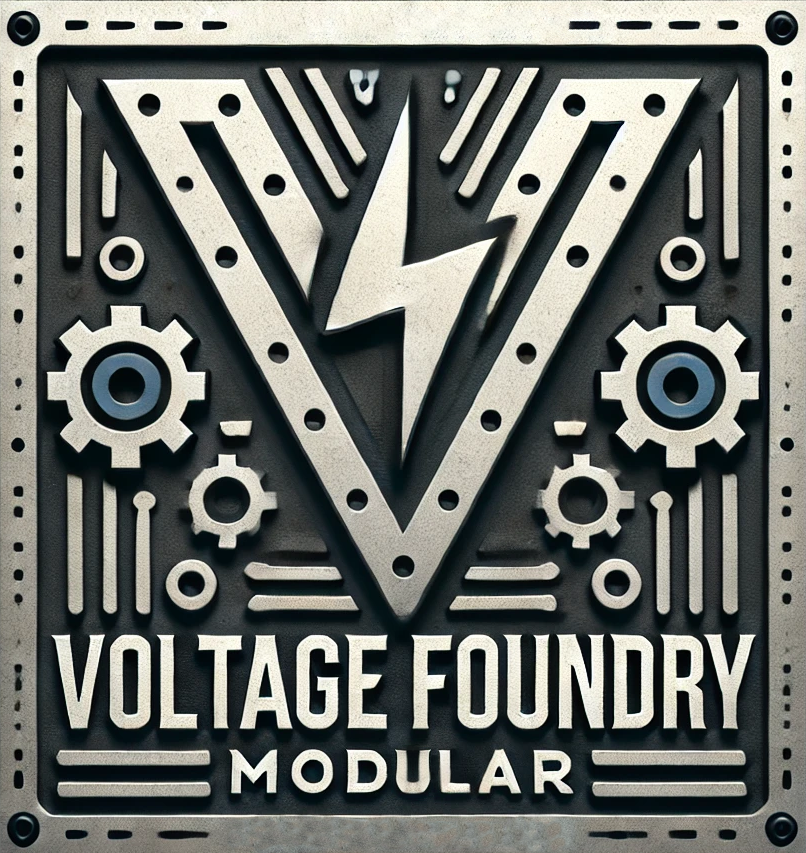

# Voltage Foundry Modular



This repository is a collection of Eurorack modules based on the fantastic work of Hagiwo and some of my creation. The modules are designed to be easy to build and modify and be built with through-hole components. The firmware is based on the Arduino platform.

The concept is to have a generic hardware with a display, rotary encoder, trigger inputs and output, CV inputs and outputs allowing different modules by changing the firmware.

The module's core uses a Seeeduino Xiao (SAMD21/Cortex M0 chip) and a MCP4725 DAC.

This project currently provides the following modules:

- [ClockForge](./firmware-CLK/) - A Clock Generator with multiple features like tap tempo, clock division, Euclidean rhythm and more.
- [NoteSmith](./firmware-DQ/) - A Dual Quantizer with selectable scales and root notes for each channel, octave shift and envelopes.
- [ForgeView](./firmware-SCP/) - A scope visualizer with dual-trace, trigger and more.

Modules can also be found on ModularGrid:

- [ClockForge](https://modulargrid.net/e/other-unknown-clockforge-by-voltage-foundry-modular)
- [NoteSmith](https://modulargrid.net/e/other-unknown-notesmith-by-voltage-foundry-modular)

Each new module firmware will be in a separate folder which can be built and uploaded to the Seeeduino Xiao using PlatformIO.


## Production specifications

- Eurorack standard 3U 6HP size
- Power supply: 60mA
- Module depth: 40mm
- On-board converter from 12V to internal 5V (jumper selectable)

Power supply can be select from an on-board jumper where closing the the SEL with REG jumper, will take power from eurorack 12V supply and closing the SEL with BOARD jumper, will take power from 5V (requires 16 pin cable). It can also be powered by the USB-C jack on the Seeeduino Xiao.

## Project State

- ✅ - Working
- ❎ - Not tested
- ❓ - In progress

| Firmware             | Support  |
| -------------------- | ---------|
| Hardware             |    ✅    |
| Clock Generator      |    ✅    |
| Dual Quantizer       |    ✅    |
| Scope                |    ✅    |
| Sequencer            |    ❎    |
| Generative Sequencer |    ❎    |

## Simulations

- Clock Generator: [Link](https://wokwi.com/projects/403851982905059329)

## Hardware and PCB

You can find the schematic and BOM in the root folder.
For the PCBs, the module has one main circuit PCB, one control circuit PCB and one panel PCB. The files are available in the [gerbers](./gerbers/) directory.
You can order them on any common PCB manufacturing service, I used [JLCPCB](https://jlcpcb.com/). I made the circuits pcbs under 100mm to get the discount price.
Standard settings should be fine, but as there is exposed copper on the panel you should go with a lead free surface finish (ENIG/Leadfree HASL).
If the panel size is not correctly detected by JLC (happens on some of my exports) manually put 30x128.5 mm.

When ordering the display module, make sure to choose an 0.96 I2C oled module that has the pinout specified as GND-VCC-SCL-SDA as opposed to VCC-GND-SCL-SDA (both exist and the latter will fuck it up).

Also make sure you order a Seediuno XIAO (with a SAMD21/Cortex M0 chip) as opposed to the XIAO esp32c3 or the XIAO rp2040, those are different chips.


Pinout Diagram:

```text
|--------------------|
|                    |
|         O          |    1
|                    |
|   O           O    |  2   3
|                    |
|                    |
|   O           O    |  4   5
|                    |
|   O           O    |  6   7
|                    |
----------------------
```

- 1 - Trigger / Clock Input
- 2 - CV In 1
- 3 - CV In 2
- 4 - Digital Out 1
- 5 - Digital Out 2
- 6 - Analog Out 1 (Internal DAC)
- 7 - Analog Out 2 (External DAC)

## Assembly

When assembling, you can either use a header for the screen or solder it directly, as it is a litte too tall.
The 7805 voltage regulator is optional, if you do not want to use it, simply solder the SEL header on the back of the main pcb to BOARD instead of REG (meaning you bridge the connection to choose your 5v voltage source to either be 12 regulated to 5v, or a 5V connection of your rack power if you have it).

## Calibration

There are two things  in the circuit that need to be tuned for: The input resistor divider going from 5V to 3.3V, and the output opamp gain to go from 3.3 back to 5V.
I will provide a script to help with this and a detailed description in the future, but for now the short version is: Input resistors are compensated for in code with the AD_CH1_calb/AD_CH2_calb parameters. Output gain is adjusted using the trimmers on the main pcb.

Vin(5v) *(R21(33k)/R21(33k)+R19(18k) = Vout
5v:1 = Vout:a(AD_CH1_calb) (in my case AD_CH1_calb = 0.971)

3.3v to 5v(scale up)
5v/3.3v = 1.51515
0.51515 = 5k(adjustable)/6.8k

## Acknowledgements

The initial [hardware](./Hardware/) is based on Hagiwo 033 module. The quantizer base code is from the [original](https://note.com/solder_state/n/nb8b9a2f212a2) Hagiwo 033 Dual Quantizer and the updated thru-hole project by [Testbild-synth](https://github.com/Testbild-synth/HAGIWO-029-033-Eurorack-quantizer). Some ideas for the clock module were "taken" from the [LittleBen module](https://github.com/Quinienl/LittleBen-Firmware) from Quinie.nl.
