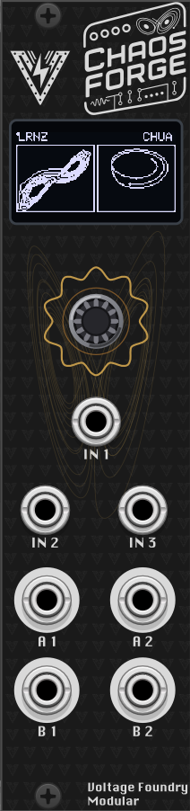
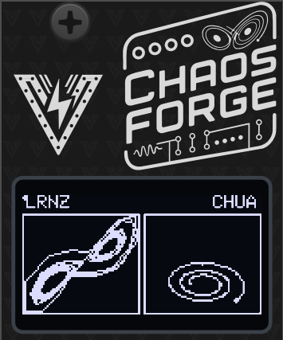
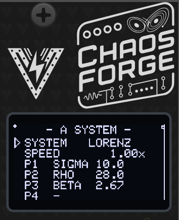
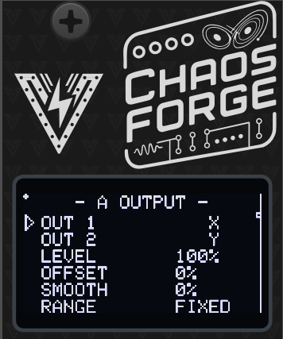
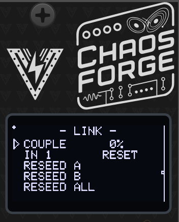
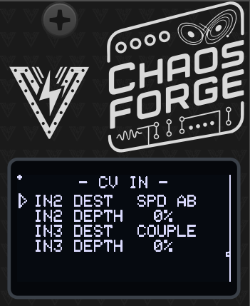
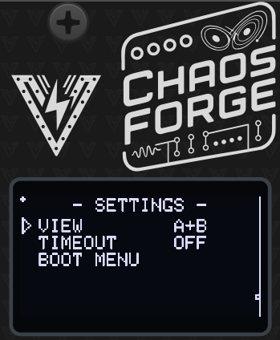
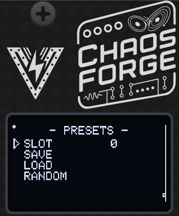

# ChaosForge — A Chaotic-Attractor Modulation Source


## Overview

Dual chaotic-attractor modulation source for the ForgeSeries hardware, and a VCV
Rack module built from the same core.

The module is built with a catalogue of published chaotic systems, each with its own constants and three state variables. Each generator runs one system, and the two can be linked to pull on each other.

The module hosts two attractors at a time and the user can adjust the constants, speed, output axes, level, offset and smoothing for each. The attractors are drawn on the screen in real time, and the user can assign two modulation inputs to control speed, constants, level, offset or coupling.



Check the module on [ModularGrid](https://modulargrid.net/e/voltage-foundry-modular-chaosforge).

## Features

- Three inputs to control the attractor parameters
- Two outputs from each attractor, for a total of four jacks
- Two attractors, each with its own system, constants, speed, output axes, level, offset and smoothing
- A link between the two attractors, adjustable for variation and strength
- Nothing is ever quite the same twice, but it always sounds like the same instrument.

- [ChaosForge — A Chaotic-Attractor Modulation Source](#chaosforge--a-chaotic-attractor-modulation-source)
  - [Overview](#overview)
  - [Features](#features)
  - [Front panel](#front-panel)
  - [The screen](#the-screen)
  - [Menu map](#menu-map)
  - [A SYSTEM / B SYSTEM](#a-system--b-system)
  - [A OUTPUT / B OUTPUT](#a-output--b-output)
  - [LINK](#link)
  - [CV IN](#cv-in)
  - [SETTINGS](#settings)
  - [PRESETS](#presets)
  - [The twelve systems](#the-twelve-systems)
  - [In VCV Rack](#in-vcv-rack)

---

## Front panel

| Jack               | What it is                                                                                                             |
| ------------------ | ---------------------------------------------------------------------------------------------------------------------- |
| **IN 1**           | Trigger/gate. Its job is set by LINK ▸ IN 1: re-seed both orbits, re-seed one, or freeze both while the input is high. |
| **IN 2**, **IN 3** | Assignable modulation CV, 0–5 V. Destination and depth are set on the CV IN page.                                      |
| **A 1**, **A 2**   | Generator A's two outputs, 0–5 V. Each follows one axis of A's orbit.                                                  |
| **B 1**, **B 2**   | Generator B's two outputs.                                                                                             |

The **encoder** turns to move through the menu, clicks to enter or leave a value,
and — held for two seconds — returns to the module selector.

Everything is 0–5 V. There is no negative rail on this hardware; OFFSET slides the
pair inside that range and LEVEL scales it.

## The screen



Left alone, the screen shows the **plot**: each generator's two outputs drawn
against each other. That is the view that shows what the module is actually doing
— one trace against time is a wobble, the pair is the attractor.

```txt
 LRNZ      C45      RSSL      <- system names, and COUPLE when it is up
┌───────────┐┌───────────┐
│    ╱▔▔╲ ││  ╱▔╲      │
│   ╱   ○│  ││ ○   ╲     │    ○ = where the orbit is right now
│  ╲___╱    ││  ╲__╱     │
└───────────┘└───────────┘
```

- The **filled dot** is the present; the trail behind it is where the orbit has
  just been. It is sampled on the orbit's own clock, so the figure covers the same
  amount of trajectory at any SPEED.
- The centre badge shows **C** and the couple percentage while LINK is up, or
  **FRZ** while IN 1 is holding the orbits frozen.
- The plot draws the value _before_ LEVEL and OFFSET, so the figure keeps filling
  the frame however the jacks are scaled. A trace flattening against the frame
  edge means the jack is clipping.
- SETTINGS ▸ VIEW gives a single generator the whole screen.

While you are turning any control that changes the figure, the plot takes over the
screen with the value in a strip along the bottom, so you can see the effect and
read the number at the same time. It hands the page back a few seconds after you
stop.

## Menu map

Turning the encoder walks through every row; the page changes when you cross into
the next group.

| Page         | Rows                                             |
| ------------ | ------------------------------------------------ |
| **plot**     | the home screen                                  |
| **A SYSTEM** | SYSTEM · SPEED · P1 · P2 · P3 · P4               |
| **A OUTPUT** | A1 · A2 · LEVEL · OFFSET · SMOOTH · RANGE        |
| **B SYSTEM** | as A                                             |
| **B OUTPUT** | B1 · B2 · LEVEL · OFFSET · SMOOTH · RANGE        |
| **LINK**     | COUPLE · IN 1 · RESEED A · RESEED B · RESEED ALL |
| **CV IN**    | IN2 DEST · IN2 DEPTH · IN3 DEST · IN3 DEPTH      |
| **SETTINGS** | VIEW · TIMEOUT · BOOT MENU                       |
| **PRESETS**  | SLOT · SAVE · LOAD · RANDOM                      |

## A SYSTEM / B SYSTEM



**SYSTEM** — which set of equations this generator runs. Changing it loads that
system's published constants, because parameter 1 means SIGMA on Lorenz and ALPHA
on Chua; the old numbers would mean nothing in the new equation.

**SPEED** — 0.01× to 100×, and 1.00× is comparable motion on every system: a
Lorenz wing takes about four seconds there, a Rössler circuit about six. The
control is geometric, so a detent is a percentage rather than a fixed amount, and
turning faster moves further.

1.00× is deliberately a tenth of the rate these systems are usually _shown_ at —
that rate is a good one to look at and a fast one to modulate with, so the middle
of the dial sits well below it and the top of the range reaches it and beyond.

**P1 – P4** — that system's own constants, shown with the names the literature
uses. A system with fewer than four shows the unused rows as `-`; Sprott B and C
have none at all, which is the point of them. Some of these ranges include
_periodic_ windows where the system stops being chaotic and settles into a
repeating loop — that is a usable sound (a pair of smooth, oddly-shaped LFOs), not
a fault. Thomas's B is the one to explore for it.

If a setting leaves the system with no bounded orbit at all, the generator
re-seeds itself rather than pinning the jack to a rail. You will hear the pattern
restart; back the constant off.

## A OUTPUT / B OUTPUT



**A1 / A2** (and B1 / B2 for generator B) — which state variable each
jack follows: X, Y or Z.

The four jacks are two rows of two, and **each generator owns a column**:
A1 above A2 down the left, B1 above B2 down the right. Which pair is which is
therefore readable at a glance, which two identical-looking rows would not be. Every system's three axes have different characters;
Rössler's Z, for example, is flat with occasional sharp folds while its X and Y
drift smoothly.

Pointing both jacks at the same axis is allowed, and gives two copies of one
voltage. It is also the quickest way to prove to yourself that the pair really are
different signals.

**LEVEL** — 0–100 %, scaling the swing around the middle of the range. At 0 the
jack sits at 2.5 V, not at 0 V.

**OFFSET** — ±100 %, sliding the pair up or down inside 0–5 V.

**SMOOTH** — 0–100 %, a lag on the output. Rounds the leading edge of the one fast
event some of these systems have.

**RANGE** — FIXED or AUTO.

- **FIXED** scales the jack by a window measured at the system's published
  constants. Predictable and identical every boot.
- **AUTO** tracks the orbit's own window instead. Use it once you have moved the
  constants far enough that the figure no longer fills the jack — it widens
  instantly and closes back in slowly, so a rare excursion is never clipped.

## LINK



**COUPLE** — 0–100 %, how hard the two orbits pull on each other. At 0 they are
completely independent. Turned up they _entrain_: they start sharing their timing
while keeping their own shapes. Near the top, two generators running the same
system lock onto a single orbit and all four jacks become two signals.

**IN 1** — what the trigger jack does:

|             |                                                                                         |
| ----------- | --------------------------------------------------------------------------------------- |
| **RESET**   | a rising edge puts both orbits back on their start points                               |
| **RESET A** | ...just generator A                                                                     |
| **RESET B** | ...just generator B                                                                     |
| **FREEZE**  | while the input is **high**, both orbits hold, and every output holds its exact voltage |

FREEZE reads the level rather than the edge, so it is playable with a gate.
Releasing resumes where it stopped — the paused time is not banked and replayed.

**RESEED A / B / ALL** — the same gesture from the menu. On a system this
sensitive, re-seeding is not "the same pattern again": the two generators start a
thousandth apart and are somewhere else entirely within seconds. It is a fresh
draw from the same figure.

## CV IN



Two assignable modulation inputs, each with a destination and a depth.

| Destination                   | What it moves                                                                 |
| ----------------------------- | ----------------------------------------------------------------------------- |
| **OFF**                       | nothing                                                                       |
| **SPD A / SPD B / SPD AB**    | speed, ±3 octaves at full depth                                               |
| **P1 A / P1 B / P2 A / P2 B** | the first or second constant of a generator, over a fraction of its own range |
| **LVL A / LVL B / LVL AB**    | level — _downward_ from the menu setting, so the jack becomes a VCA           |
| **OFS A / OFS B**             | offset                                                                        |
| **COUPLE**                    | the link between the generators                                               |

Depth is 0–100 %. Speed is modulated multiplicatively, because it is a rate.
Level modulates downward on purpose: at LEVEL 100 %, where the control is nearly
always left, upward modulation would do nothing.

## SETTINGS



**VIEW** — whether the plot shows both generators side by side (`A+B`) or gives
one of them the whole screen.

**TIMEOUT** — how long the menu waits before dropping back to the plot.

**BOOT MENU** — returns to the module selector, which is also the only way into
the board's calibration wizard. Holding the encoder for two seconds does the same
thing.

## PRESETS



Ten slots. Slot 0 is loaded automatically at power-on, so save the patch you want
to boot into there.

**RANDOM** rolls a new pair of systems, constants, speeds, axes and shaping — and
a modest amount of COUPLE. It deliberately leaves the IN 1 role, the CV matrix, the
view and RANGE alone: those are how the module is wired into the patch, not how it
sounds. It does not write a slot, so a saved patch is one LOAD away.

The dot in the top-left corner means there are unsaved changes.

## The twelve systems

| System         | Constants           | Character                                                                                        |
| -------------- | ------------------- | ------------------------------------------------------------------------------------------------ |
| **Lorenz**     | SIGMA, RHO, BETA    | The double wing. Switches lobes at irregular intervals — the classic.                            |
| **Rössler**    | A, B, C             | Smooth spiral with a sharp fold on Z. The nearest thing here to an event output.                 |
| **Thomas**     | B                   | The gentlest: no spikes, all three axes alike. Its range holds several periodic windows.         |
| **Chua**       | ALPHA, BETA, M0, M1 | The double scroll, and the one you can build out of op-amps.                                     |
| **Halvorsen**  | A                   | Three-fold symmetry, three interlocked scrolls.                                                  |
| **Chen**       | A, B, C             | The fastest and widest here. Found while trying to control Lorenz.                               |
| **Burke-Shaw** | S, V                | A compact, tightly wound figure-eight.                                                           |
| **Aizawa**     | A, B, C, D          | A torus with a spiralling skirt. Two further shape constants are held at their published values. |
| **Dadras**     | A, B, C, D          | A knotted structure with sharp direction changes.                                                |
| **Sprott B**   | —                   | Minimal chaos, three terms, nothing to turn.                                                     |
| **Sprott C**   | —                   | The other minimal one; a different route into chaos.                                             |
| **Finance**    | A, B, C             | Boom/bust cycles. Its Y axis leans rather than swings.                                           |

## In VCV Rack

The Rack module runs the same firmware. The screen, the encoder and every menu
page behave identically — drag the encoder to scroll, click to select, or hover
the module and use `[`, `]` and space.

The right-click menu offers the same parameters as real option lists and sliders,
which is faster than relaying encoder detents:

- **Hardware** — input CV range, encoder sensitivity, which generator the screen
  shows.
- **Link** — couple, the IN 1 role, re-seed both.
- **CV modulation** — destination and depth for IN 2 and IN 3.
- **Generator A / Generator B** — attractor, speed, that system's constants (the
  list changes with the system), output axes, level, offset, smooth, auto range
  and a per-generator re-seed.

**Initialize** restores the factory patch; **Randomize** rolls the same kind of
patch the panel's RANDOM does. Patch save/load carries the whole module state,
including your preset slots.

## Hardware Calibration

The module ships with sensible default values, but for best precision — especially when using quantization or 1V/oct pitch CV — you should run the hardware calibration wizard once after building or assembling the module.

Calibration covers two things:

**Output trim**: the output op-amp gain is set with on-board trimmers so every output jack delivers exactly 5.00 V at full scale. This is purely a hardware adjustment — there is no software output scaling.
**CV input calibration**: each CV input is measured at two known reference voltages (1 V and 3 V) to build a per-channel linear correction (`mv = scale × reading + offset`) that compensates for resistor tolerances and ADC offset. This is done with external references and is independent of the module's own outputs, so any output-trim error does not propagate into the input calibration.

Calibration data is stored in a dedicated area of non-volatile memory **separate from presets**, so it survives firmware updates and preset load/save operations.

### What you need

- A multimeter capable of measuring DC voltage to at least two decimal places (for the output trim).
- A stable, known **1 V** and **3 V** source for the CV inputs — for example a precision voltage reference, a bench power supply, or a calibrated sequencer/quantizer output — and a patch cable to connect it.

### Running calibration

The wizard has 5 steps: one output trim followed by four CV input captures (1 V and 3 V on each of the two inputs).

1. Power on the module **from your Eurorack supply** while **holding the encoder button** pressed, which opens the module selector. Release the button, scroll to **CALIBRATE** at the bottom of the list and click. (From a running module you can get to the same screen with **SETTINGS → BOOT MENU**, or by holding the encoder for two seconds.) Click the encoder at the welcome screen to start.

   Calibration belongs to the board, not to any one module: one run covers every module in the firmware, and the wizard reboots back to the selector when it is done.

   > ⚠️ Calibrate on Eurorack power, **not** the MCU's USB port — USB cannot drive the outputs to full scale, so the trim would be wrong. **Never connect Eurorack power and USB at the same time, as this could damage the module.**

2. **Step 1 — Output trim** (`1/5  OUTPUT TRIM`):
   All four outputs are driven to full scale. Using a multimeter set to DC voltage, probe each output jack in turn and adjust its corresponding trimmer potentiometer on the PCB until the reading is exactly **5.00 V**. When all four outputs read 5.00 V, press the encoder to continue.

3. **Steps 2–5 — CV input capture** (`2/5` … `5/5`):
   The display asks for a specific reference voltage on a specific input, in turn:
   - `2/5  CV1 INPUT 1V` — apply **1 V** to CV input 1
   - `3/5  CV1 INPUT 3V` — apply **3 V** to CV input 1
   - `4/5  CV2 INPUT 1V` — apply **1 V** to CV input 2
   - `5/5  CV2 INPUT 3V` — apply **3 V** to CV input 2

   For each step, apply the requested voltage to the named input. The screen shows a live voltage reading so you can confirm the signal is stable; when it is steady, press the encoder to capture (256 ADC samples are averaged). Repeat for all four steps.

4. **Review and save**:
   The display shows the derived per-channel scale and offset for a sanity check. Press the encoder to **save and reboot**. The module restarts with calibration applied.

> **Tip:** Calibration only needs to be run once. Re-run it if you replace any resistors or trimmers on the board, or if CV tracking feels off after assembly.

## Firmware Update

1. Download the latest firmware from the Releases section of the [GitHub repository](https://github.com/VoltageFoundryMod/ForgeSeries/releases). The firmware file is named `CURRENT.UF2`.
2. Connect the module to your computer using a USB-C cable while holding the small BOOT (B) button. The CPU can be removed from the module as it's socketed to the main board if desired. Firmware loading can be done with the CPU removed.
3. A new drive will show on your computer named RPI-RP2. Copy and overwrite the `CURRENT.UF2` file to the module USB drive. After copy is finished, the module will reboot and the new firmware will be loaded.


## Troubleshooting

- **No Power**: Ensure the module is properly connected to the power supply and the power jumper is set correctly.
- **No Output**: Verify the board connections and output settings and ensure the module is not stopped.
- **Inconsistent BPM**: Ensure the external clock signal is stable and properly connected.

## Powering

The module uses only 5V internally. This can be provided directly by a Eurorack supply with a 5V rail, or taken from the 12V line and converted to 5V on-board. The source is selected with an on-board jumper: closing the center pin to **INT REG** takes power from the Eurorack 12V supply, while closing the center pin to **EURO** takes power from the 5V rail (requires a 16-pin cable). It can also be powered from the USB-C jack on the microcontroller board.

**Never connect both the Eurorack power and the USB-C power at the same time**. The module might be damaged or even damage your computer if both are connected. The module is designed to be powered from either source, not both.

## Specifications

- **Power Supply**: 12V or 5V jumper selectable
- **Input CV Range**: 0–5V
- **Output CV Range**: 0–5V
- **Dimensions**: 6HP
- **Depth**: 40mm
- **Current Draw**: 60mA @ +12V or +5V

## Contact

For support and inquiries, please open an issue on the [GitHub repository](https://github.com/VoltageFoundryMod/ForgeSeries).

## Acknowledgements

Parts of the code are inspired by Hagiwo code, Quinienl's [LittleBen](https://github.com/Quinienl/LittleBen-Firmware) and Pamela's Workout.
Thanks for the inspiration!

## License

Source code is GPL-3.0-or-later — see the
[LICENSE](https://github.com/VoltageFoundryMod/ForgeSeries/blob/main/LICENSE) in the source repository.

Panel designs, graphics, module names and the Voltage Foundry Modular brand are
copyright and are not covered by that licence; see
[LICENSE-ASSETS.md](https://github.com/VoltageFoundryMod/ForgeSeries/blob/main/LICENSE-ASSETS.md).

---

Thank you for choosing the ClockForge module. We hope it enhances your musical creativity and performance.
