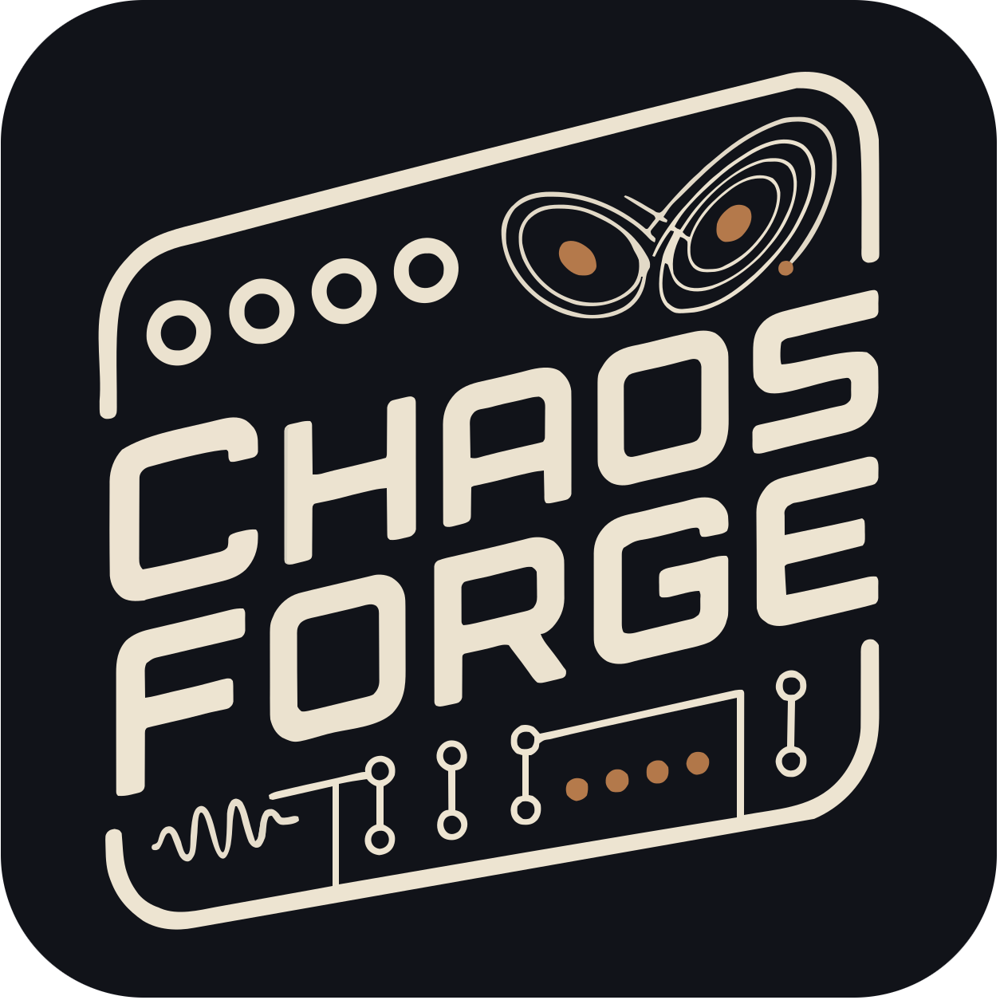

# ChaosForge

**Dual chaotic-attractor modulation source.** Two strange attractors run side by
side; each sends two of its three state variables to a pair of output jacks. Four
voltages that are related without ever repeating, and a LINK control that lets the
two systems pull on each other.

Part of the [ForgeSeries](../../README.md) — same board, same shell, same
calibration as every other module in the family.

---

## What it is for

An LFO repeats exactly. A random source has no shape at all. A strange attractor
is the third thing: completely deterministic, smooth, with a figure you can learn
to recognise — and yet it never repeats, and two copies started a thousandth apart
are somewhere else entirely within seconds.

- Three inputs to control the attractor parameters
- Two outputs from each attractor, for a total of four jacks
- Two attractors, each with its own system, constants, speed, output axes, level, offset and smoothing
- A link between the two attractors, adjustable for variation and strength
- Nothing is ever quite the same twice, but it always sounds like the same instrument.

## At a glance

|                   |                                                                                                                         |
| ----------------- | ----------------------------------------------------------------------------------------------------------------------- |
| **Systems**       | Lorenz, Rössler, Thomas, Chua, Halvorsen, Chen, Burke-Shaw, Aizawa, Dadras, Sprott B, Sprott C, Finance                 |
| **Outputs**       | 4 × 0–5 V CV — two per generator, each following a chosen axis                                                          |
| **Inputs**        | IN 1 re-seed / freeze · IN 2 + IN 3 assignable modulation                                                               |
| **Per generator** | system, speed (0.01×–16×), up to four of that system's own constants, output axes, level, offset, smoothing, range mode |
| **Link**          | COUPLE, from unrelated through entrained to locked together                                                             |
| **Screen**        | live Lissajous plot of each generator's output pair                                                                     |
| **Presets**       | 10 slots, slot 0 auto-loaded at boot, plus RANDOM                                                                       |

## The controls that matter

**SYSTEM** picks the equations. Each one has its own figure and its own character:
Lorenz's double wing switches lobes at irregular intervals; Rössler drifts smoothly
then folds sharply on Z; Thomas is the gentlest, with no spikes at all; Chen is the
fastest and widest.

**SPEED** is a multiplier on the rate that system was catalogued at, so 1.00×
means the same kind of motion whichever system is selected. From 0.01× (a drift
that takes minutes to go anywhere) to 16× (audible-adjacent noise).

**The constants** — SIGMA, RHO, ALPHA, and so on, named as the literature names
them — reshape the attractor itself. Some ranges include periodic windows where
the system stops being chaotic and becomes a pair of smooth repeating LFOs with an
unusual shape. That is a feature, not a bug; Thomas's B is the one to explore for
it.

**COUPLE** is the signature control. At 0 the two generators are unrelated. Turned
up they entrain — sharing their timing while keeping their own shapes — and near
the top, two copies of one system lock into a single orbit and the four jacks
become two.

**RANGE** decides how an orbit is fitted to the 0–5 V jack. FIXED uses a window
measured at the system's published constants: predictable, and identical from one
boot to the next. AUTO tracks the orbit's own window, which is what you want once
you have moved the constants far enough that the figure no longer fills the jack.

## Patch ideas

- **The default patch.** OUT 1 and OUT 2 (Lorenz X and Y) to filter cutoff and a
  wavefolder; OUT 3 and OUT 4 (a slow Rössler) to a reverb size and a pan. One
  fast pair, one slow pair, nothing repeating.
- **One voice, two hands.** Both jacks of a generator into two parameters of the
  same voice. They will never agree and never fight.
- **Entrained pair.** Two generators on the same system, COUPLE around 30–50 %.
  Two voices that keep drifting into and out of agreement.
- **Sparse events.** Rössler with a jack on Z: smooth most of the time with an
  occasional sharp fold. Feed it to a comparator for gates that are rare but not
  random.
- **Frozen chord.** IN 1 set to FREEZE, hold a gate: every output stops dead and
  holds its exact voltage. Release and the orbits resume — they do not
  fast-forward through the pause.

---

## Usage

For more details and usage instructions, see [Manual.md](Manual.md).

## Contact

For support and inquiries, please open an issue on the [GitHub repository](https://github.com/VoltageFoundryMod/ForgeSeries).

## Acknowledgements

Thanks to NonLinear Circuits for the inspiration and many other open-source Eurorack makers that share their knowledge and work!

## License

This project is licensed under the MIT License. See the `LICENSE` file for more information.

---

Thank you for choosing the ChaosForge module. We hope it enhances your musical creativity and performance.
