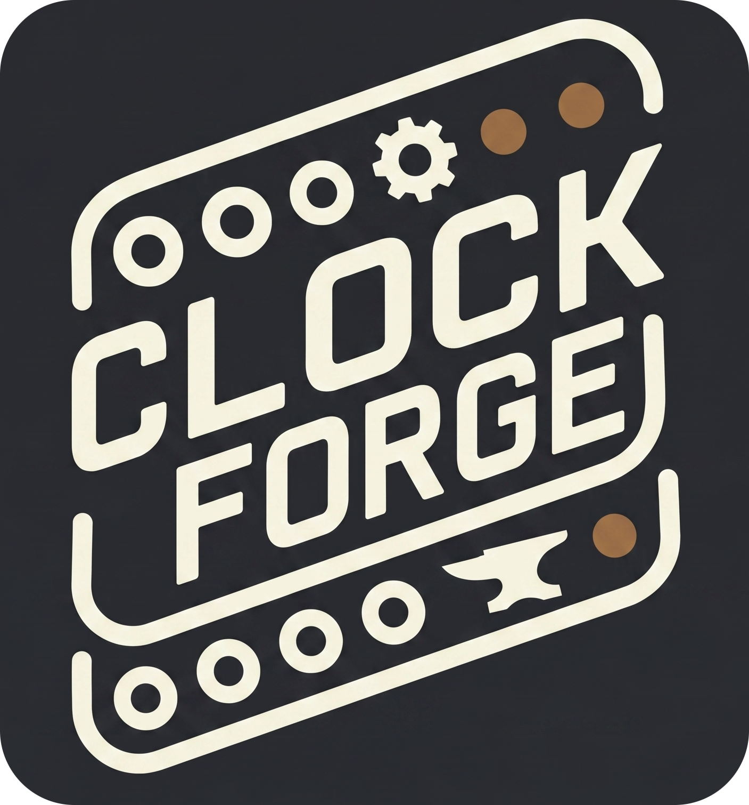

# ClockForge 2: Crafting Time, One Pulse at a Time

## Overview

ClockForge provides clock signals and waveforms for synchronizing and modulating other modules in your Eurorack system. It features a global BPM control, multiple clock outputs, adjustable clock multiplication and division per output, tap tempo functionality, sync to external clock sources, Euclidean rhythm generation, CV Input modulation matrix and custom swing patterns per output.

Part of the **Forge** series of modules which share a single hardware platform. The new ClockForge 2 is an updated version with a more powerful microcontroller and 4 outputs that can generate clocks, waveforms and envelopes.

Most parts of this manual applies to both Hardware and VCV Rack plugin with exceptions to hardware specific features like calibration, powering and firmware update. The VCV Rack plugin is a full software emulation of the hardware module and can be used to test the module without having the physical hardware.

The hardware schematics and design files are completely open-source and available in the [GitHub repository](https://github.com/VoltageFoundryMod/ForgeSeries-Hardware).

Check the module on [ModularGrid](https://modulargrid.net/e/voltage-foundry-modular-clockforge).

## Features

- **Global BPM Control**: Set the global BPM for all outputs.
- **Multiple Clock Outputs**: Four clock outputs with individual settings.
- **Adjustable Clock Multiplication and Division**: Configure each output to multiply or divide the global BPM.
- **Output Waveform Generation**: Outputs can generate different waveforms for modulation.
- **Pulse Probability**: Set the probability of a pulse occurring.
- **Euclidean Rhythm Generation**: Generate complex rhythms using Euclidean algorithm.
- **Custom Swing Patterns**: Apply swing to each output individually.
- **Sync to External Clock Sources**: Automatically adjust BPM based on an external clock signal with adjustable clock divider.
- **Phase Shift**: Adjust the phase of the output in relation to the master clock.
- **Waveform Duty Cycle and Level/Offset**: Adjust the pulse width and level/offset of the clock signal.
- **External modulation**: Many parameters can be modulated by the CV inputs by assigning CV targets.
- **Tap Tempo Functionality**: Manually set the BPM by tapping a button.
- **Quantization**: Quantize the output wave or CV input to some scale and root note.
- **Envelopes**: Outputs can generate different types of envelopes (AD, AR, ADSR) triggered by CV inputs.
- **Cross Operations**: Modulate an output with another output or CV input using arithmetic, logic and sample/hold operations.
- **Loops**: Rewind an output's pattern every few beats to build repeating, structured random/Euclidean phrases, with nap/wake muting.
- **Save/Load Configuration**: Save and load up to 10 configurations.

The module has a user-friendly interface with an encoder for navigation and parameter adjustment, and a clear display showing the current settings and status of each output. The main screen shows the BPM and the status of each output, while navigating into each output's settings allows for detailed configuration of that specific output. There are no submenus as all parameters are accessible by scrolling horizontally on the same menu screen.

The right side of the screen shows a navigation line to indicate the current position of the cursor in the menu. The navigation is not shown in the main (BPM) screen.

Whenever a parameter is changed, a small circle will be shown in the top-left corner of the screen. This indicates that the current settings were modified and not saved. The module always loads the preset saved in slot 0 on boot.

The current hardware design supports input signals from 0 to 5V, and the outputs are also 0-5V. The VCV Rack plugin module can be set to accept CV signals in the range of 0 to 5V like the hardware, -5 to +5V or 0 to 10V for more flexibility. The hardware might support other input/output ranges in the future but for now, voltages higher than 5V will be clipped and voltages lower than 0V will be ignored.

## Usage

For more details and usage instructions, see [Manual.md](Manual.md).

## Contact

For support and inquiries, please open an issue on the [GitHub repository](https://github.com/VoltageFoundryMod/ForgeSeries).

## Acknowledgements

Parts of the code are inspired by Hagiwo code, Quinienl's [LittleBen](https://github.com/Quinienl/LittleBen-Firmware) and Pamela's Workout.
Thanks for the inspiration!

## License

Source code is GPL-3.0-or-later — see the [LICENSE](../../LICENSE) at the
repository root.

Panel designs, graphics, module names and the Voltage Foundry Modular brand are
copyright and are not covered by that licence; see
[LICENSE-ASSETS.md](../../LICENSE-ASSETS.md).

---

Thank you for choosing the ClockForge module. We hope it enhances your musical creativity and performance.
