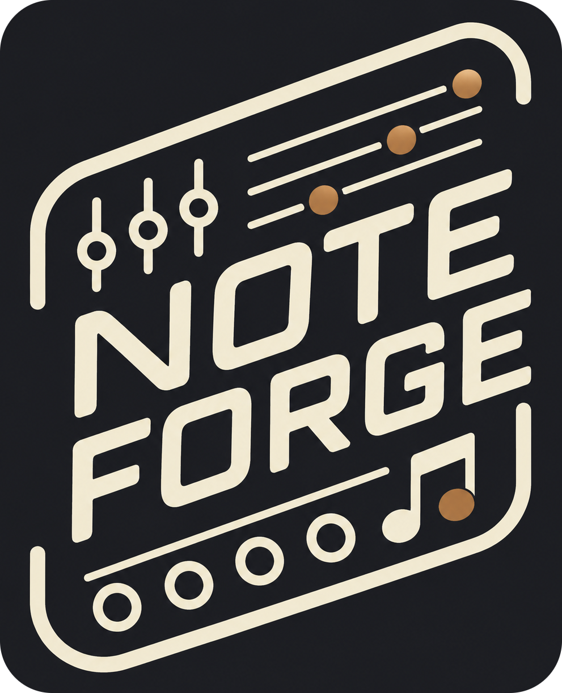

# NoteForge - A Dual Quantizer Eurorack Module

## Introduction

NoteForge quantizes analog control voltages into musical notes. It has two fully
independent quantizers: each takes a pitch CV, snaps it to a scale you can edit
note by note, and emits a quantized CV plus a gate or envelope.

Part of the **Forge** series of modules, which share a single hardware platform
based on the Seeed XIAO RP2040. The hardware schematics and design files are
open-source and available in the
[hardware repository](https://github.com/VoltageFoundryMod/ForgeSeries-Hardware).

NoteForge also runs as a **VCV Rack plugin** — not a reimplementation, but the
actual firmware running inside Rack with the OLED emulated pixel for pixel. See
[docs/VCVRack_Plugin.md](docs/VCVRack_Plugin.md).

Check it out on [ModularGrid](https://modulargrid.net/e/voltage-foundry-modular-noteforge).

## Features

- Two independent quantizers, each with its own 12-note scale mask
- 15 built-in scales in any root, plus free per-note editing on the keyboard screen
- 12-bit quantized CV output on both channels (0–5 V, 1V/oct, 5 octaves)
- Boundary hysteresis so a CV resting on a note edge never chatters
- Per-channel gate/envelope output: AD envelope, fixed trigger, or gate
- Sync on trigger input, on note change, or both
- Per-channel octave shift, glide (portamento) and a note settle window
- Settle suppresses the notes an input sweeps through between two pitches
- Per-channel sample & hold: latch the note on a trigger and ignore the input between them
- IN 2 can become a transposition CV, stepping both channels in scale degrees
- 10 preset slots, with slot 0 loaded automatically at power-on
- Two-point CV input and output calibration wizard
- OLED display and rotary encoder for everything

## Usage

For more details and usage instructions, see [Manual.md](Manual.md).

## Contact

For support and inquiries, please open an issue on the
[GitHub repository](https://github.com/VoltageFoundryMod/ForgeSeries-DQ'''''''').

## License

This project is licensed under the MIT License. See the `LICENSE` file for more
information.
