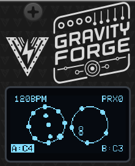
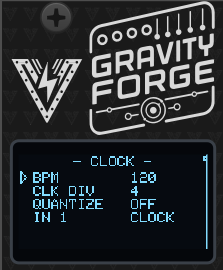
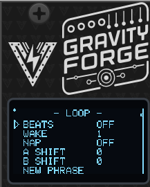
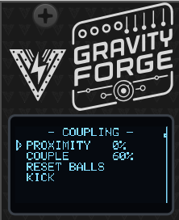
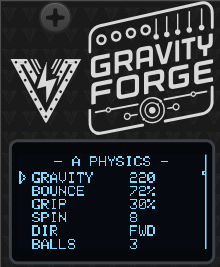
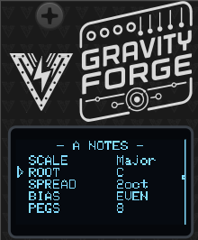
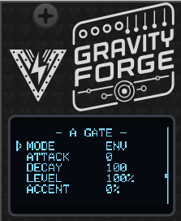
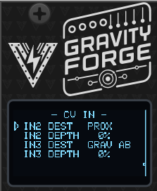
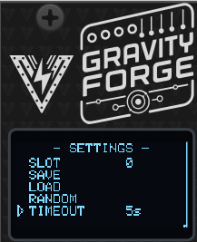

# GravityForge: Sequencing by Falling


## Overview

GravityForge is a dual physics-based generative sequencer. Two virtual containers hold bouncing balls; gravity pulls them down, the containers rotate, and every time a ball strikes a peg on a container wall it plays a note. A single **PROXIMITY** control slides the two containers together, taking them from independent sequencers, through overlapping-and-coupled, to a single merged space.

Part of the **Forge** series of modules which share a single hardware platform. Most of this manual applies to both the hardware and the VCV Rack plugin, with the exception of hardware-specific topics like calibration, powering and firmware update.


Check the module on [ModularGrid](https://modulargrid.net/e/voltage-foundry-modular-gravityforge).

---

## User Manual

- [GravityForge: Sequencing by Falling](#gravityforge-sequencing-by-falling)
  - [Overview](#overview)
  - [User Manual](#user-manual)
  - [How it works](#how-it-works)
  - [Jacks](#jacks)
  - [Operation](#operation)
    - [Interface](#interface)
    - [The physics screen](#the-physics-screen)
    - [Menu pages](#menu-pages)
  - [Parameters](#parameters)
    - [Clock](#clock)
    - [Loop](#loop)
    - [Coupling](#coupling)
    - [Physics (per container)](#physics-per-container)
    - [Notes (per container)](#notes-per-container)
    - [Gate (per container)](#gate-per-container)
    - [CV Input Modulation](#cv-input-modulation)
    - [Settings](#settings)
    - [Presets](#presets)
  - [Working with the module](#working-with-the-module)
    - [What you hear out of the box](#what-you-hear-out-of-the-box)
    - [Getting a first sequence](#getting-a-first-sequence)
    - [Using proximity musically](#using-proximity-musically)
    - [Taming or thickening the density](#taming-or-thickening-the-density)
    - [Slow, ambient patterns](#slow-ambient-patterns)
    - [Keeping a phrase](#keeping-a-phrase)
    - [Locking to a grid](#locking-to-a-grid)
    - [External clock sync](#external-clock-sync)
    - [Muting pegs](#muting-pegs)
    - [Randomize](#randomize)
    - [Save/Load Configuration](#saveload-configuration)
  - [VCV Rack Plugin](#vcv-rack-plugin)
  - [Hardware Calibration](#hardware-calibration)
    - [What you need](#what-you-need)
    - [Running calibration](#running-calibration)
  - [Firmware Update](#firmware-update)
  - [Troubleshooting](#troubleshooting)
  - [Powering](#powering)
  - [Specifications](#specifications)
  - [Contact](#contact)
  - [License](#license)

## How it works

Each container is a circle with a ring of **pegs** on its wall and a number of **balls** inside it. Gravity accelerates the balls downward; the container rotates and drags the balls along with it through friction at the wall (**GRIP**), and each impact loses some energy (**BOUNCE**).

When a ball hits the wall hard enough, the peg at that point of the rim fires:

- the **CV output** of that container jumps to the pitch of that peg;
- the **GATE output** of that container fires an envelope, trigger or gate.

Pegs are laid out around the ring in ascending pitch, so where the ball lands determines the note. Every peg is a degree of the selected scale, so nothing can play out of key.

Nothing is stepped by the clock: the physics always free-runs, and the notes land where the balls land. The clock only sets how fast the containers rotate and, optionally, provides a grid the notes can be deferred onto.

Container A drives OUT 1 and OUT 3; container B drives OUT 2 and OUT 4.

## Jacks

| Jack  | Direction | Signal                                                           |
| ----- | --------- | ---------------------------------------------------------------- |
| IN 1  | Input     | Trigger/gate input. Role selectable: CLOCK, RESET, KICK or SPAWN |
| IN 2  | Input     | Assignable CV modulation (0–5 V)                                 |
| IN 3  | Input     | Assignable CV modulation (0–5 V)                                 |
| OUT 1 | Output    | **CV A** — pitch of the last peg hit in container A              |
| OUT 2 | Output    | **CV B** — pitch of the last peg hit in container B              |
| OUT 3 | Output    | **GATE A** — envelope / trigger / gate for container A           |
| OUT 4 | Output    | **GATE B** — envelope / trigger / gate for container B           |

The jack map is deliberately identical to NoteForge, so it stays muscle memory across the series.

CV outputs follow the usual 1V/oct convention within the module's 0–5 V range, which is why the pitch span is centred and limited to five octaves.

Which notes those volts _are_ depends on the oscillator you patch into, so tell the module: **SETTINGS ▸ 0V NOTE** names the note its 0 V stands for (default `C4`, VCV Rack's convention and the common one on hardware VCOs). The module's range is then `C4` at 0 V up to `C9` at 5 V, and the notes on the home screen are the ones you hear. It only renames the shown note — the voltage on the jack never moves.

## Operation

### Interface

The module is driven entirely from the rotary encoder:

- **Turn** (while navigating): move between parameters. Crossing a group boundary changes the page.
- **Click** on a value parameter: enter edit mode. The value is now changed by turning the encoder.
- **Click** again: leave edit mode.
- **Click** on an action row (RESET BALLS, KICK, SAVE, LOAD, RANDOM, BOOT MENU): execute it immediately.
- **Click** on a toggle row (DIR): flip it immediately.

Turning the encoder quickly accelerates the step size (up to 8× for a fast spin), so long ranges like BPM or DECAY can be crossed without a lot of turning. Reversing direction always resets to single steps.

A small dot in the top-left corner means the current settings differ from the saved preset. The line on the right edge of the screen shows where you are in the whole parameter list.

If **TIMEOUT** is set, the display returns to the physics screen after that many seconds of inactivity. The timeout does not apply while a parameter is in edit mode.

### The physics screen



The home screen is the simulation itself, not an illustration of it:

- **Top left**: the tempo. An `E` after the number means an external clock is actually running into IN 1.
- **Top right**: `PRX` and the current proximity percentage.
- **Middle**: the two containers. Container A's balls are drawn filled, container B's hollow, so they stay tellable apart when proximity merges the two circles into one space.
- **On the rims**: pegs. A solid dot is an active peg, a small hollow ring is a muted one, and a peg flashes larger for a few frames when it fires.
- **Bottom**: the live note of each channel (`A:` and `B:`). The label is inverted while that channel's gate is up.
- **Expanding rings**: a coupling spark — a strike in one container that transmitted into the other. This is the cue that tells you the containers are actually talking to each other.

### Menu pages

Turning the encoder from the home screen walks through the pages in this order:

| Page          | Contents                                           |
| ------------- | -------------------------------------------------- |
| **HOME**      | The physics view                                   |
| **CLOCK**     | BPM, clock divider, quantize grid, IN 1 role       |
| **COUPLING**  | Proximity, couple amount, reset balls, kick        |
| **A PHYSICS** | Gravity, bounce, grip, spin, direction, ball count |
| **B PHYSICS** | Same, container B                                  |
| **LOOP**      | Phrase length, nap/wake, per-container shift       |
| **A NOTES**   | Scale, root+octave, spread, bias, pegs, density    |
| **B NOTES**   | Same, container B                                  |
| **A GATE**    | Mode, attack, decay, level, accent, space          |
| **B GATE**    | Same, container B                                  |
| **CV IN**     | IN 2 / IN 3 destination and depth                  |
| **SETTINGS**  | The note at 0 V, screen timeout, boot menu         |
| **PRESETS**   | Preset slot, save, load, randomize                 |

## Parameters

### Clock



- **BPM** — Internal tempo, 20 to 300. This sets the container rotation rate and the quantize grid. When an external clock is live, the screen shows the derived tempo with an `E`, and this setting is what the module falls back to when the external clock stops.
- **CLK DIV** — How many pulses per quarter note the external clock at IN 1 sends: 1, 2, 4, 8 or 24. Use 4 for the common 16th-note Eurorack clock, 1 for a clock that already emits quarter notes.
- **QUANTIZE** — The grid that peg hits are deferred onto: `OFF`, `1/4`, `1/8`, `1/16`, `1/8T`, `1/16T`. See [Locking to a grid](#locking-to-a-grid).
- **IN 1** — What the trigger input does:
  - **CLOCK** — External clock. Tempo is derived from the interval between edges.
  - **RESET** — Re-places all balls and zeroes the rotation on every rising edge.
  - **KICK** — Applies an impulse to every ball, shaking both containers.
  - **SPAWN** — Adds a ball to both containers on each pulse, wrapping back to one after the maximum of eight.

### Loop



The simulation is deterministic: the same state, stepped the same number of
times, produces the same notes. Loop mode uses that to keep a phrase — it
snapshots the balls, the rotation and the random generator, and puts them back
every _N_ beats. What was an endless stream becomes something that repeats.

- **BEATS** (`OFF`, 1–64) — Length of the phrase in beats. `OFF` is the default
  and free-running is the module's normal state; set a length when you hear
  something worth keeping. The rewind lands on an exact simulation step, so the
  phrase repeats note for note rather than drifting apart after a few passes.
- **WAKE** (1–16) — How many loops a container plays before it naps.
- **NAP** (`OFF`, 1–16) — How many loops it then stays silent for. `OFF` means it
  never naps. The simulation keeps running through a nap — only the output is
  muted — so the phrase stays in phase and comes back exactly where it left off.
- **A SHIFT / B SHIFT** (0–16) — Offset each container's position in the
  wake/nap cycle. This is what turns nap/wake from an on-off stutter into
  call-and-response; see [Keeping a phrase](#keeping-a-phrase).
- **NEW PHRASE** — Throw the captured phrase away and keep whatever the balls are
  doing right now. The loop is a lottery, and this is the re-roll.

While a loop is running, the home screen shows `L n/N` — the beat you are on and
the phrase length. A napping channel shows `zz` instead of its note.

Changing **BEATS** captures a new phrase immediately. A _tempo_ change does not:
the new length is picked up at the next loop boundary, so the phrase always ends
where it started even while the BPM is moving.

Everything else stays live over the top of a locked phrase. Gravity, proximity,
the peg mutes, the scale and all CV modulation still apply — the loop rewinds the
motion, not the settings. Changing **SCALE** re-registers the phrase without
touching its rhythm.

### Coupling



- **PROXIMITY** (0–100 %) — Slides the two containers together. At 0 % they sit apart and are completely independent. As it rises they overlap, and a wall strike whose contact point falls inside the other container transmits energy into it **and rings the peg nearest that point on the receiving rim**. At 100 % they are fully merged into one shared space.

  The transmitted note is always the _receiving_ container's own peg — its scale, its root, its spread and bias, its mutes — so a transfer can never sound out of key. Muting a peg absorbs the transfer silently, which is how you choose which transfers speak.

- **COUPLE** (0–100 %) — How strongly a transmitted collision arrives. Low values only nudge trajectories; the containers begin audibly answering each other as this comes up. Proximity decides _whether_ they touch; couple decides _how hard_.
- **RESET BALLS** — Re-place all balls at their starting positions and zero the rotation.
- **KICK** — Give every ball a random impulse. Useful when a patch has settled into something too regular, or to restart motion after a very low gravity setting.

Note that both containers stay separate instruments even when merged: each keeps its own gravity, scale, peg ring and outputs. This is energy transfer, not ball transfer, so the ball count in each container never drifts.

### Physics (per container)



- **GRAVITY** (5–900) — The container's tempo control. Gravity scales the whole simulation in _time_: the balls trace the same paths and strike the same pegs, they just take longer to get there. It changes _how often_ pegs are struck, not how hard.

  With three balls, measured:

  | GRAVITY | Notes per second | Average gap |
  | ------- | ---------------- | ----------- |
  | 5       | 0.9              | 1080 ms     |
  | 30      | 2.3              | 440 ms      |
  | 120     | 4.6              | 220 ms      |
  | 220     | 6.2              | 160 ms      |
  | 600     | 10.2             | 100 ms      |
  | 900     | 12.6             | 80 ms       |

  Fewer balls thins it further — a single ball at GRAVITY 5 speaks about once every three seconds, which is where the slow ambient settings live.

  Note that a fast **SPIN** competes with this. The rotating wall is its own energy source and does not scale with gravity, so at SPIN `1` or `1/2` the wall is stirring the container harder than gravity is pulling on it and GRAVITY loses most of its authority over the density. SPIN `4` and slower leave it in charge.

- **BOUNCE** (10–98 %) — How much energy survives an impact. High values keep the balls lively and the pattern busy; low values let them settle toward the bottom of the container and tick along more sparsely.
- **GRIP** (0–100 %) — How much of the rotating wall's motion is transferred to a ball on contact. This is what makes a rotating container actually stir the balls instead of just spinning a decorative ring behind them. At 0 % rotation only moves the pegs under the balls; at high values the balls get carried around the rim.
- **SPIN** — Rotation rate in **beats per revolution**: `1/2`, `1`, `2`, `4`, `8`, `16`. Tied to the clock, so rotation stays musically related to the patch. Faster spin sweeps the peg ring under the balls more quickly and moves the melody around more.
- **DIR** — `FWD` or `REV`. Reversing one container against the other is an easy way to make two containers with identical settings behave differently.
- **BALLS** (1–8) — How many balls are in the container. More balls means a denser pattern and more coupled hits, at the cost of predictability.

### Notes (per container)



- **SCALE** — One of 15 scales: Chromatic, Major, Minor, Dorian, Phrygian, Lydian, Mixolydian, Locrian, Pentatonic Minor, Pentatonic Major, Harmonic Minor, Melodic Minor, Whole tone, Diminished, Blues.
- **ROOT** (`C4` … `B8`) — The root note _with its octave_, and the note the peg ring starts on. This is the container's register: the ring opens upward from here, so `ROOT C4` puts the channel at the bottom of the module's range and `ROOT C7` puts it near the top. One detent is a semitone; spin faster to cover octaves. The octave shown follows **0V NOTE**, so it is the note your oscillator plays.

  The ceiling depends on SPREAD, since the whole ring has to fit under 5 V: a 2-octave ring stops at `C7`, a 5-octave ring can only start at `C4`. Widening SPREAD walks ROOT down rather than letting the top of the ring flatten out.

- **SPREAD** (1–5 oct) — How many octaves the peg ring covers, counted upward from ROOT, independent of the peg count. `ROOT C4` + `SPREAD 2` gives a ring from C4 to C6 (0–2 V); `SPREAD 5` uses the whole 0–5 V range.
- **BIAS** (`LO100` … `EVEN` … `HI100`) — Where inside that span the notes crowd. `EVEN` spaces the pegs evenly; `LO` bunches them into the low notes, `HI` into the high ones. The lowest and highest pegs never move, so SPREAD keeps meaning exactly what it says.

  With 8 pegs in C major, `ROOT C4` and SPREAD 2:

  | BIAS    | Notes around the ring   |
  | ------- | ----------------------- |
  | `EVEN`  | C4 E4 G4 B4 D5 F5 A5 C6 |
  | `LO100` | C4 D4 E4 F4 G4 A4 C5 C6 |
  | `HI100` | C4 C5 E5 F5 G5 A5 B5 C6 |

- **PEGS** (3–16) — How many pegs are on the ring. Fewer pegs means bigger intervals between neighbouring notes and a more angular melody; more pegs means smaller steps and a more scalar one. Changing the count re-maps every peg's pitch, since the count is what decides where each peg falls within SPREAD.
- **DENSITY** (0–100 %) — The chance that a strike actually speaks. At 100 % every valid hit becomes a note, which is the module's original behaviour. Lower it and notes drop out at random while the balls carry on exactly as before — this is the only thinning control that leaves the motion untouched, so the screen stays as lively as it was and only the output gets sparser. At 0 % the container is silent but still bouncing, still coupling and still driving the display.

ROOT, SPREAD and BIAS between them say exactly where every peg is: where the ring starts, how far it reaches, and how the notes bunch inside it. Nothing is inferred — earlier firmware centred the ring in the output range, which parked a one-octave ring two octaves up with no way to move it.

**0V NOTE** is not a fourth pitch control: it renames the range, it does not move it.

### Gate (per container)



- **MODE**
  - **ENV** — An AD envelope: attack up, then decay. Retriggered by every hit.
  - **TRIG** — A fixed 10 ms pulse at full level on every hit. Use this to drive drums or anything that only wants a clean trigger.
  - **GATE** — Follows the level at IN 1, ignoring the hits. Useful when you want an external gate to shape the voice.
- **ATTACK** (0–2000 ms) — Envelope attack time. Zero gives an instant onset.
- **DECAY** (0–4000 ms) — Envelope decay time. Keep this shorter than the gap between hits, or the envelope never returns to zero and the output stops behaving like a gate. At factory settings a container fires roughly six times a second, which is why the default decay is 100 ms. **SPACE**, below, is how you buy room for a longer one.
- **LEVEL** (0–100 %) — Gate output level, 100 % being 5 V.
- **ACCENT** (0–100 %) — How much a ball's impact speed scales the gate level. At 0 % every hit is the same height; at high values soft grazes come out quiet and hard strikes come out full. Accent applies in ENV mode only — a trigger pulse has to keep a fixed height or downstream modules will start missing it.
- **SPACE** (`OFF`, `1/4`, `1/2`, `1`, `2`, `4`, `8` beats) — A minimum gap between two notes from this container. A note arriving sooner than the gap is dropped; one arriving later plays the instant it happens. It follows the tempo, so the spacing moves with the BPM.

  This is a rate _ceiling_, not a grid — it never moves a note, so the rhythm stays as human as the physics made it, just sparser. **QUANTIZE** on the CLOCK page is the control that snaps notes onto a grid, and the two work together: QUANTIZE decides where notes may land, SPACE decides how close together they may land.

  SPACE is also what makes long decays usable. At `1` beat and 90 BPM nothing can arrive less than 660 ms apart, so a 500 ms decay always finishes.

### CV Input Modulation



IN 2 and IN 3 each have a **DEST** (destination) and a **DEPTH** (0–100 %). Depth 0 means the input does nothing, so a patched cable never changes anything until you dial some in.

| Destination | Effect                                    |
| ----------- | ----------------------------------------- |
| `OFF`       | Input unused                              |
| `GRAV A`    | Gravity trim, container A                 |
| `GRAV B`    | Gravity trim, container B                 |
| `GRAV AB`   | Gravity trim, both containers             |
| `SPIN A`    | Rotation rate multiplier, container A     |
| `SPIN B`    | Rotation rate multiplier, container B     |
| `SPIN AB`   | Rotation rate multiplier, both containers |
| `BOUNCE`    | Bounce trim, both containers              |
| `BALLS`     | Ball count, both containers               |
| `PEGS A`    | Peg count, container A                    |
| `PEGS B`    | Peg count, container B                    |
| `PROX`      | Proximity                                 |
| `COUPLE`    | Coupling amount                           |
| `DENS A`    | Density, container A                      |
| `DENS B`    | Density, container B                      |
| `DENS AB`   | Density, both containers                  |

The **trim** targets (gravity, spin, bounce) are bipolar: 2.5 V is no change, below that subtracts and above that adds. The **amount** targets (balls, pegs, proximity, couple, density) are unipolar: 0 V adds nothing and 5 V adds the full depth on top of the menu setting.

Modulation is always applied _on top_ of what you set in the menu, never written into it — the menu keeps showing your setting and presets store your setting, not this instant's CV value.

Spin is modulated as a continuous multiplier rather than by stepping through the beats-per-revolution list, so a CV sweep glides the rotation instead of jumping between ratios.

`PROX` on a slow LFO is the single most rewarding patch on this module: the containers drift in and out of each other's reach and the two voices go from independent to entangled and back.

`DENS AB` on a slow LFO is the second: set DENSITY low in the menu and let the CV open the containers up, and the patch breathes between near-silence and a full run without the motion on screen changing at all. Put `DENS A` and `DENS B` on out-of-phase LFOs and the two voices hand off to each other.

### Settings



- **0V NOTE** (`C0`–`C5`, default `C4`) — Which note the module should _call_ its 0 V. The row shows the note and the range that follows from it:

  ```text
  0V NOTE   C4   C4-C9
  ```

  This is a display preference — the modular equivalent of a DAW asking whether middle C is called C3 or C4. **It changes no voltage and no sound.** The outputs are 0–5 V at every setting; all it decides is what the home screen, the ROOT row and the Rack menu call them.

  Set it to whatever the oscillator you are patched into calls 0 V (`C4` in VCV Rack and on most hardware VCOs) and every note name on the module becomes the note you actually hear. If you tune by ear and never look at the note names, you can ignore this row entirely.

  The control that _moves_ the pitch is **ROOT**, on the NOTES page.

- **TIMEOUT** — Return to the physics screen after `OFF`, `2s`, `5s`, `10s` or `20s` of inactivity.
- **BOOT MENU** — Hand the hardware back to the module selector, so you can run a different Forge module — or the calibration wizard — without power-cycling. GravityForge flushes anything it owes to flash first, then the module reboots into the selector. Holding the encoder for two seconds does the same thing from anywhere in the menu.

### Presets

- **SLOT** (0–9) — The preset slot that SAVE and LOAD act on.
- **SAVE** — Write the current settings to the selected slot.
- **LOAD** — Recall the selected slot.
- **RANDOM** — Roll a whole new patch. See [Randomize](#randomize). It sits here rather than under Settings because, like LOAD, it replaces the whole patch — it just rolls the new one instead of reading it from a slot.

## Working with the module

### What you hear out of the box

The factory patch is deliberately **two different instruments**, one per container, with PROXIMITY at 0 so they run independently. Patch both pairs of jacks and you have the module's whole range in front of you before you change anything:

|           | **A** — OUT 1 / OUT 3           | **B** — OUT 2 / OUT 4                                                  |
| --------- | ------------------------------- | ---------------------------------------------------------------------- |
| Character | The sequencer                   | The ambient voice                                                      |
| Rate      | ~6 notes/sec                    | ~1 note every 2 s                                                      |
| Notes     | C major, `ROOT C4`, two octaves | C pentatonic major, `ROOT C6`, one octave — on top of A, not inside it |
| Physics   | GRAVITY 220, 3 balls, SPIN 8    | GRAVITY 20, 1 ball, SPIN 16                                            |
| Gate      | 100 ms decay                    | 120 ms attack, 750 ms decay                                            |
| Thinning  | none                            | DENSITY 85 %, SPACE `2`                                                |

B is the worked example for everything in [Slow, ambient patterns](#slow-ambient-patterns) below — its settings are exactly what that section builds, so you can read the recipe off the menu pages rather than typing it in. Its scale is a subset of A's on purpose: the two containers drift into every possible alignment, so B's notes have to be ones that cannot clash with A's whatever lands together.

Then turn **PROXIMITY** up. With the containers this far apart in character it is the most rewarding control on the module — A's busy strikes start shaking notes out of B's slow one.

### Getting a first sequence

From the factory patch:

1. Set **SCALE** and **ROOT** on the A NOTES and B NOTES pages. Give the two containers different roots a fifth apart for an easy two-voice patch.
2. Set **PEGS**. Around 5–8 gives clear melodic movement; 12–16 gives something closer to a run.
3. Set **SPREAD** to choose the register width, then **BIAS** if you want the melody to sit low or high inside it.
4. Adjust **GRAVITY** and **BALLS** on the physics pages until the density feels right.
5. On the GATE pages, pick **ENV** for pitched voices or **TRIG** for drums, and set **DECAY** shorter than the gaps between notes.

### Using proximity musically

PROXIMITY is a continuous gradient, and the useful territory is the middle of it:

- **0 %** — Two independent sequencers sharing a screen.
- **20–60 %** — The containers overlap. Strikes near the shared area transmit, so occasional notes appear in one container that were caused by the other. This is where the two voices start sounding like they are listening to each other.
- **100 %** — One merged space. Density roughly doubles, and both channels ring almost continuously.

If it appears to be doing nothing, check that **COUPLE** is above about 50 % — below that the transmitted energy nudges the balls but is not hard enough to ring a peg. The expanding spark rings on the physics screen tell you a transfer actually happened.

### Taming or thickening the density

Every hit is one note, and at factory settings a container fires about six times a second. Five controls thin it out, and they are not interchangeable — each gives up something different:

| Control     | What it does                    | What else changes                 |
| ----------- | ------------------------------- | --------------------------------- |
| **DENSITY** | Drops notes at random           | Nothing — the motion is identical |
| **SPACE**   | Enforces a minimum gap          | Nothing — the motion is identical |
| **GRAVITY** | Slows the whole simulation down | The balls visibly slow too        |
| **BALLS**   | Fewer sources of hits           | Less interplay, more predictable  |
| **PEGS**    | Fewer pegs on the ring          | Wider intervals in the melody     |

DENSITY and SPACE are the two that leave the simulation alone — the screen looks exactly as busy as it did and only the output thins. They compose cleanly: SPACE puts a ceiling on the rate, DENSITY thins whatever got through. At SPACE `1` and DENSITY 50 % you get at most one note per beat, and roughly half the beats speak.

Muting pegs is a sixth route — a muted peg still bounces the ball, it just does not speak — but it also decides _which_ notes survive rather than how many.

To thicken instead: more balls, higher gravity and bounce, faster **SPIN**, and more proximity.

### Slow, ambient patterns

Container **B** already ships this way, so the fastest way to learn it is to walk the B pages and read what each control is doing. Building it from scratch on A:

1. **A PHYSICS** — GRAVITY 20, BALLS 1, BOUNCE 45 %. One slowly falling ball. GRAVITY is doing the real work here: it rescales the whole simulation in time, so this is about a third of the default tempo. Keep **SPIN** at `8` or slower — the rotating wall is an energy source that does _not_ scale with gravity, so a fast spin stirs the container harder than low gravity pulls on it and undoes the slowness.
2. **A NOTES** — SCALE Pentatonic Major, SPREAD 1, PEGS 5. One peg per scale degree, so the ring _is_ the scale. A pentatonic has no semitone in it, which is what lets it sit under another voice without ever fighting it.
3. **A NOTES ▸ DENSITY** — around 85 %. Drops the occasional note so the line wanders instead of ticking, without touching the motion on screen.
4. **A GATE** — SPACE `2`, then ATTACK 120 ms and DECAY 750 ms. Do these in that order: SPACE sets a hard floor under the gap (two beats, so 1000 ms at 120 BPM), and the envelope has to fit inside **that floor**, not inside the average gap. Sizing a 1500 ms decay against a 2 s average looks fine on paper and clips on every close pair.
5. **COUPLING** — PROXIMITY around 40 %, COUPLE 70 %. The containers now occasionally answer each other, which is where the "evolving" comes from.
6. **CV IN** — `DENS AB` on a very slow LFO at 60 % depth, with DENSITY set to 30 % in the menu. The patch now breathes over minutes.

Add **LOOP** BEATS 8 with NAP 1 / WAKE 3 if you want it to settle into something that repeats and then opens back up. Turn GRAVITY down toward 5 for the extreme end — about one note every three seconds from a single ball.

### Keeping a phrase

The module generates continuously and never repeats, which is what it is for —
but it also means a passage you like is gone by the time you reach for the
encoder. Loop mode is the answer.

1. Patch as normal and let it run until something catches your ear.
2. On the LOOP page set **BEATS** to the phrase length you want — 4 or 8 to
   start. From the next boundary the module repeats that phrase exactly.
3. If you set the length a moment too late and captured the wrong bar, click
   **NEW PHRASE** to grab the current one instead. Keep clicking until one lands.
4. Everything else still works over the top. Sweep **PROXIMITY**, change the
   scale, mute pegs, ride a CV — the phrase's rhythm holds while the sound around
   it moves.
5. Set **BEATS** back to `OFF` to let it run free again.

**Call-and-response.** Set **WAKE** 1, **NAP** 1, **A SHIFT** 0 and **B SHIFT** 1.
Container A plays the first loop while B rests, then they swap. With **WAKE** 2
and **NAP** 2 they trade two-loop phrases instead. Because the physics never
stops during a nap, each container comes back exactly where it would have been.

**Longer forms.** **WAKE** 3 with **NAP** 1 on B alone gives a container that
drops out for one loop in four — a structure, rather than a texture, without any
sequencing of your own.

A loop is only as reproducible as the settings under it. Modulating gravity or
ball count from a CV while a loop runs will change the phrase — usually the
interesting kind of change, but if you want the phrase frozen, leave the physics
alone and modulate the note mapping instead.

### Locking to a grid

The physics free-runs and the notes land where they land, which is the point of the module. When a patch needs the rhythm locked, set **QUANTIZE** on the CLOCK page to a division: a peg hit is then held and released on the next grid boundary.

If a second hit arrives for the same channel before the pending one has been released, the newer one replaces it. A dense passage therefore releases as one note on the boundary rather than a burst of retriggers, which keeps the result sounding like the physics that produced it.

### External clock sync

1. Set **IN 1** to `CLOCK` on the CLOCK page (this is the default).
2. Patch your clock into IN 1 and set **CLK DIV** to match its resolution (4 for a 16th-note clock, 1 for quarter notes).
3. The tempo display shows the derived BPM with an `E` next to it while pulses are actually arriving.

When the clock stops or is unpatched, the module falls back to the internal BPM setting after a short timeout scaled to the tempo it was receiving. The module tracks clocks from 20 to 300 BPM and uses a median of the last few intervals, so a single jittery edge will not lurch the rotation.

### Muting pegs

Muting individual pegs is how you open up the rhythm without changing the physics — a muted peg still bounces the ball, it just does not play a note. It is also how you decide which coupled transfers speak.

On the hardware, the peg mask is set by **RANDOM** and stored with each preset. In the VCV Rack plugin, individual pegs are toggled under **right-click ▸ Container A/B ▸ Active pegs**.

### Randomize

**SETTINGS ▸ RANDOM** rolls a whole new patch: physics, scale, root, spread, bias, peg count, peg mutes, gate settings, proximity and coupling for both containers. In VCV Rack, the standard Randomize (Ctrl+R) does exactly the same thing.

It deliberately leaves the tempo, the clock divider, the quantize grid, the IN 1 role and the CV modulation matrix alone — those are the things you cabled up on purpose, and rerolling them would turn "give me a new rhythm" into "break my patch".

The ranges it draws from are narrower than the full parameter ranges, so a roll always lands on something that actually plays a sequence rather than a container that either barely rings a peg or buzzes continuously. It never writes a preset slot, so a saved patch is one LOAD away.

### Save/Load Configuration

The module has 10 memory slots (0–9). The parameters saved into slot 0 are automatically loaded on boot.

1. Navigate to **SLOT** on the PRESETS page.
2. Click the encoder, turn to the desired slot, and click again to leave edit mode.
3. Select **SAVE** and click the encoder to store the current settings in that slot.
4. Select **LOAD** and click the encoder to recall it.

The dot in the top-left corner of the screen disappears once the current state has been saved.

## VCV Rack Plugin

The VCV Rack plugin is a full software emulation of the hardware module and can be used without owning the physical hardware. It runs the same firmware code, so the behaviour matches. The plugin saves and loads its configuration inside the patch, in the same way as the hardware module does in its memory, without the use of VCV Rack presets.

Every parameter is reachable from the module's right-click context menu, grouped as **Coupling**, **Clock**, **Loop**, **CV modulation** and one submenu per container. The encoder and screen work as they do on the hardware, so either route is available.

Some features are exclusive to the plugin:

- Setting the input CV range to 0-5V, -5V to +5V or 0-10V. The hardware module only supports 0-5V.
- Setting the encoder sensitivity.
- Toggling individual pegs on and off from the **Active pegs** submenu.

## Hardware Calibration

The module ships with sensible default values, but for best precision — especially when using the CV outputs for 1V/oct pitch — you should run the hardware calibration wizard once after building or assembling the module.

Calibration covers two things:

**Output calibration**: the output op-amp gain is set with on-board trimmers so every output jack delivers exactly 5.00 V at full scale, and the wizard then measures each output's low point to correct any residual offset in firmware.
**CV input calibration**: each CV input is measured at two known reference voltages (1 V and 3 V) to build a per-channel linear correction that compensates for resistor tolerances and ADC offset. This is done with external references and is independent of the module's own outputs, so any output error does not propagate into the input calibration.

Calibration data is stored in a dedicated area of non-volatile memory **separate from presets**, so it survives firmware updates and preset load/save operations.

### What you need

- A multimeter capable of measuring DC voltage to at least two decimal places.
- A stable, known **1 V** and **3 V** source for the CV inputs — for example a precision voltage reference, a bench power supply, or a calibrated sequencer/quantizer output — and a patch cable to connect it.

### Running calibration

The wizard has 6 steps: output trim, output offset capture, then four CV input captures (1 V and 3 V on each of the two CV inputs).

1. Power on the module **from your Eurorack supply** while **holding the encoder button** pressed, which opens the module selector. Release the button, scroll to **CALIBRATE** at the bottom of the list and click. (From a running module you can get to the same screen with **SETTINGS → BOOT MENU**, or by holding the encoder for two seconds.) Click the encoder at the welcome screen to start.

   Calibration belongs to the board, not to any one module: one run covers every module in the firmware, and the wizard reboots back to the selector when it is done.

   > ⚠️ Calibrate on Eurorack power, **not** the MCU's USB port — USB cannot drive the outputs to full scale, so the trim would be wrong. **Never connect Eurorack power and USB at the same time, as this could damage the module.**

2. **Step 1 — Output trim** (`1/6  OUTPUT TRIM`):
   All four outputs are driven to full scale. Using a multimeter set to DC voltage, probe each output jack in turn and adjust its corresponding trimmer potentiometer on the PCB until the reading is exactly **5.00 V**. When all four outputs read 5.00 V, press the encoder to continue.

3. **Step 2 — Output offset** (`2/6  <OUT> OFFSET`):
   All outputs are driven to a nominal 1.000 V. For each output jack in turn (OUT 1 – OUT 4, i.e. CV 1, CV 2, GATE 1, GATE 2 in GravityForge's terms), measure the actual voltage at that jack and dial the measured value in with the encoder, then click to confirm. The firmware uses the difference to correct that channel. The wizard names the jacks by number rather than by role, because it runs before a module has been chosen.

4. **Steps 3–6 — CV input capture** (`3/6` … `6/6`):
   The display asks for a specific reference voltage on a specific input, in turn:
   - `3/6  CV1 INPUT 1V` — apply **1 V** to CV input 1 (IN 2)
   - `4/6  CV1 INPUT 3V` — apply **3 V** to CV input 1 (IN 2)
   - `5/6  CV2 INPUT 1V` — apply **1 V** to CV input 2 (IN 3)
   - `6/6  CV2 INPUT 3V` — apply **3 V** to CV input 2 (IN 3)

   For each step, apply the requested voltage to the named input. The screen shows a live voltage reading so you can confirm the signal is stable; when it is steady, press the encoder to capture.

5. **Review and save**:
   The display shows the derived per-channel scale and offset for a sanity check. Press the encoder to **save and reboot**. The module restarts with calibration applied.

> **Tip:** Calibration only needs to be run once. Re-run it if you replace any resistors or trimmers on the board, or if CV tracking feels off after assembly.

## Firmware Update

1. Download the latest firmware from the Releases section of the [GitHub repository](https://github.com/VoltageFoundryMod/ForgeSeries-GEN/releases). The firmware file is named `CURRENT.UF2`.
2. Connect the module to your computer using a USB-C cable while holding the small BOOT (B) button. The CPU can be removed from the module as it's socketed to the main board if desired. Firmware loading can be done with the CPU removed.
3. A new drive will show on your computer named RPI-RP2. Copy and overwrite the `CURRENT.UF2` file to the module USB drive. After the copy is finished, the module will reboot and the new firmware will be loaded.


> Note: a firmware update may change the preset format, in which case saved slots are reset to defaults on first boot. Calibration data is unaffected.

## Troubleshooting

- **No Power**: Ensure the module is properly connected to the power supply and the power jumper is set correctly.
- **No Output**: Check the GATE **LEVEL** is not at 0 %, and that the container has at least one active peg. A container whose pegs are all muted bounces silently.
- **The gate never returns to zero**: The envelope **DECAY** is longer than the gap between hits. Shorten the decay, or reduce the density (fewer balls, lower gravity or bounce).
- **Notes are too dense**: Lower **DENSITY** or raise **SPACE** — those two thin the output without changing the motion. Reducing **BALLS**, **GRAVITY**, **BOUNCE** or **PROXIMITY** also works, and changes the character as well.
- **The pattern went silent**: Check **DENSITY** is not at 0 and **SPACE** is not longer than you meant. Otherwise the balls may have settled — use **KICK** on the COUPLING page, or raise **GRAVITY** or **BOUNCE**.
- **It plays for a while, then goes quiet while the balls keep moving**: the balls have been picked up by the rotating wall and are riding the rim, where they no longer strike it. The container flicks them back off automatically, so this should recover on its own within a second or two; if a patch sits on the edge of it, slow the **SPIN** down or raise **GRAVITY** so falling wins over stirring.
- **PROXIMITY seems to do nothing**: Raise **COUPLE**. Watch for the expanding spark rings, which mark a transmitted strike.
- **Inconsistent tempo**: Ensure the external clock signal is stable and that **CLK DIV** matches its resolution.

## Powering

The module uses only 5V internally. This can be provided directly by a Eurorack supply with a 5V rail, or taken from the 12V line and converted to 5V on-board. The source is selected with an on-board jumper: closing the center pin to **INT REG** takes power from the Eurorack 12V supply, while closing the center pin to **EURO** takes power from the 5V rail (requires a 16-pin cable). It can also be powered from the USB-C jack on the microcontroller board.

**Never connect both the Eurorack power and the USB-C power at the same time**. The module might be damaged or even damage your computer if both are connected. The module is designed to be powered from either source, not both.

## Specifications

- **Power Supply**: 12V or 5V jumper selectable
- **Input CV Range**: 0–5V
- **Output CV Range**: 0–5V
- **Dimensions**: 6HP
- **Depth**: 40mm
- **Current Draw**: 60mA @ +12V or +5V

## Contact

For support and inquiries, please open an issue on the [GitHub repository](https://github.com/VoltageFoundryMod/ForgeSeries-GEN).

## License

This project is licensed under the MIT License. See the `LICENSE` file for more information.

---

Thank you for choosing the GravityForge module. We hope it enhances your musical creativity and performance.
