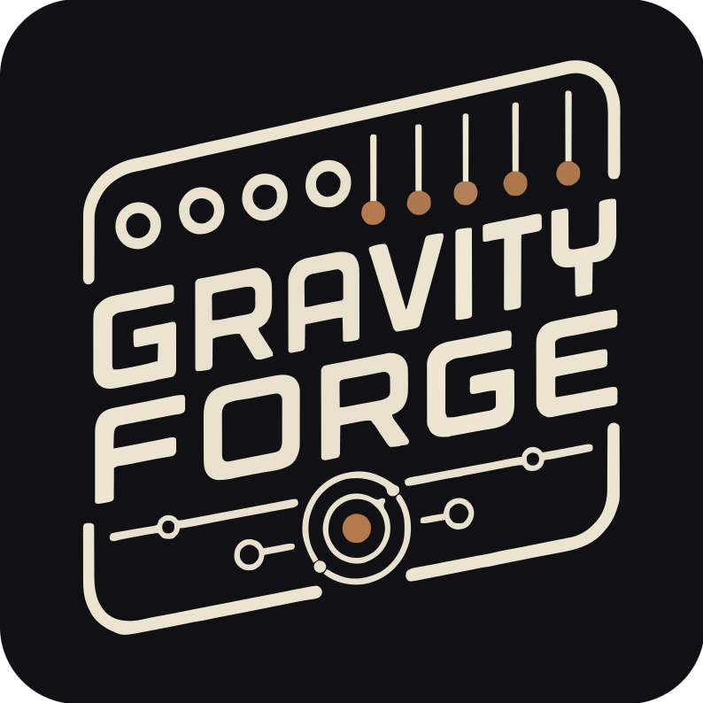

# GravityForge: Sequencing by Falling

## Overview

GravityForge is a **dual physics-based generative sequencer**. Two virtual containers hold bouncing balls. Gravity pulls them down, the containers rotate, and every time a ball strikes one of the **pegs** ringing a container wall, that peg plays a note.

Each peg _is_ a note. The ring is laid out in ascending pitch, and every peg is a degree of the container's selected scale — so where a ball happens to land decides what you hear, and nothing it can hit is out of key. Three controls shape that ring: **ROOT** is an absolute note (`C4`, not `C`) and the ring starts on it, **SPREAD** sets how many octaves it covers from there (1 to 5), and **BIAS** decides whether the notes are spaced evenly around it or crowd into the low or the high end. The **peg count** (3 to 16) then sets how finely that span is divided: a few pegs give wide intervals and an angular, arpeggio-like melody, while a full ring of sixteen gives small steps and something closer to a run. Individual pegs can be muted to open holes in the pattern — a muted peg still bounces the ball, it just stays silent.

Because the balls are never stepped by a clock, the notes land where the physics puts them: a rhythm that is repetitive enough to feel composed but never quite loops.

The signature control is **PROXIMITY**: the two containers are drawn side by side and a single parameter slides them together. Apart, they are two independent sequencers. Overlapping, a collision in one shoves the balls in the other and rings a peg on its rim. Fully merged, they share one space. It is one continuous knob from "two sequencers" to "one entangled instrument", and you can watch it happening on the screen.

Part of the **Forge** series of modules which share a single hardware platform. GravityForge runs the same board as ClockForge and NoteForge — only the firmware differs.

Most of this manual applies to both the hardware and the VCV Rack plugin, with the exception of hardware-specific topics like calibration, powering and firmware update. The VCV Rack plugin is a full software emulation of the hardware module and can be used without owning the physical module.

The hardware schematics and design files are completely open-source and available in the [GitHub repository](https://github.com/VoltageFoundryMod/ForgeSeries-Hardware).

Check the module on [ModularGrid](https://modulargrid.net/e/voltage-foundry-modular-gravityforge).

## Features

- **Two independent containers**: Each with its own gravity, bounce, rotation, ball count and peg ring, feeding its own CV and GATE output pair.
- **Proximity Coupling**: Slide the containers together to make collisions in one drive the other, from fully independent to fully merged.
- **Physics you can see**: The home screen draws the actual simulation — the balls, the peg ring, the hits and the coupling sparks are the state, not an illustration.
- **Scale-locked pitch**: Every peg is a scale degree, so no combination of settings can produce an out-of-key note. 15 scales and 12 root notes per container.
- **ROOT, SPREAD and BIAS**: ROOT is an absolute note and the ring starts on it, SPREAD sets how many octaves it covers from there, and BIAS decides where inside that span the notes crowd. Between them they place every peg — nothing is inferred.
- **Peg muting**: Individual pegs can be silenced to open up the rhythm and shape which coupled hits speak.
- **0V NOTE**: Tell the module which note your oscillator calls 0 V (C0–C5, default C4) and the notes it displays are the notes you hear.
- **Clock-locked rotation**: Container spin is set in beats per revolution (with reverse), so the motion stays musically related to the patch. Internal tempo or external clock.
- **Optional grid quantize**: The physics always free-runs, but the resulting note events can be deferred onto a 1/4 … 1/16T grid when a patch needs to lock up.
- **Loop / phrase mode**: Keep a passage you like. The simulation is deterministic, so it snapshots the balls and rewinds them every N beats, turning the endless stream into a repeating phrase — while gravity, proximity, the scale and every CV stay live over the top of it. Nap/wake mutes whole loops per container, and shifting one against the other gives call-and-response.
- **Gate shaping**: Per container AD envelope, fixed trigger or gate mode, with adjustable attack, decay and level.
- **Accent**: Scale the gate level by how hard the ball actually struck the peg, for real dynamics out of the physics.
- **CV modulation matrix**: Two assignable CV inputs covering gravity, spin, bounce, ball count, peg count, proximity and coupling — per container or both at once.
- **Assignable trigger input**: IN 1 acts as external clock, reset, kick or ball spawn.
- **Randomize**: Roll a whole new patch from the panel (or Ctrl+R in VCV Rack), leaving your clock and CV routing untouched.
- **Save/Load Configuration**: 10 preset slots, with slot 0 loaded automatically on boot.

The module has a single encoder for navigation and parameter adjustment and a 128×64 display. The main screen is the physics view; turning the encoder walks through parameter pages, and there are no submenus — every parameter is one scroll away on the same list.

The right side of the screen shows a navigation line indicating the cursor's position in the menu. It is not drawn on the main (physics) screen.

Whenever a parameter is changed, a small dot appears in the top-left corner of the screen. This indicates that the current settings were modified and not saved. The module always loads the preset saved in slot 0 on boot.

The pitch outputs cover five octaves at 1V/oct. Which notes those volts are depends on the oscillator you patch into, so **SETTINGS ▸ 0V NOTE** tells the module what its 0 V stands for (C0–C5, default C4 — VCV Rack's convention and the common one on hardware VCOs). The notes on screen are then the notes you hear; it renames the range without moving a single voltage.

The current hardware design supports input signals from 0 to 5V, and the outputs are also 0-5V. The VCV Rack plugin can be set to accept CV signals in the range of 0 to 5V like the hardware, -5 to +5V or 0 to 10V for more flexibility. Voltages higher than 5V will be clipped and voltages lower than 0V will be ignored on the hardware.

## Usage

For more details and usage instructions, see [Manual.md](Manual.md).

For the concept and the reasoning behind the design decisions, see [docs/Design.md](docs/Design.md).

## Contact

For support and inquiries, please open an issue on the [GitHub repository](https://github.com/VoltageFoundryMod/ForgeSeries-GEN).

## Acknowledgements

The concept is inspired by Teenage Engineering's Tombola sequencer. Parts of the shared platform code are inspired by Hagiwo's code, Quinienl's [LittleBen](https://github.com/Quinienl/LittleBen-Firmware) and Pamela's Workout.
Thanks for the inspiration!

## License

This project is licensed under the MIT License. See the `LICENSE` file for more information.

---

Thank you for choosing the GravityForge module. We hope it enhances your musical creativity and performance.
