# WeaveForge — A Dual Shift-Register Sequencer

## Overview

Dual shift-register sequencer for the ForgeSeries hardware, and a VCV Rack
module built from the same code.

Two 16-bit shift registers clock in parallel. Each one is a Turing Machine in
Tom Whitwell's sense: a ring of bits that shifts on every clock, with one
probability control deciding whether the bit coming round the loop flips on the
way. At one end of that control the pattern is locked forever; at the other it
never repeats; in between it is a loop that changes a note now and then.

What makes this module its own thing is **WEAVE** — one control deciding how
much of each register's incoming bit comes from the _other_ register. At zero
they are two independent sequencers. Turned up, motifs leak across and drift
back. At full, the two registers chain tail-to-head into a single ring as long
as both of them together, and the screen draws the braid while it happens.

Four outputs read windows out of those registers, and each one is assignable:
notes, smooth modulation, gates or triggers, from either register or from the
woven ring, at any depth and any rotation. So the same two registers can be two
voices, one voice plus two correlated modulations, or a four-track drum machine.

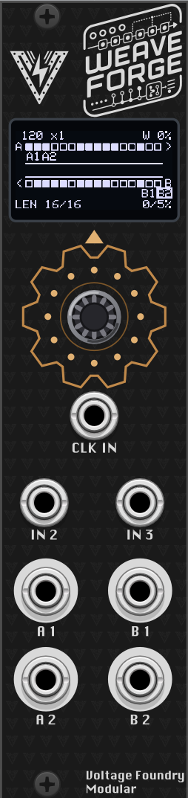

## Features

- Two 16-bit shift registers with independent length (2–16) and probability
- **WEAVE** — a continuous slide from two independent sequencers to one long one
- One-way coupling (`A▸B` / `B▸A`) for a theme-and-answer pair
- Four fully assignable outputs: source, type, window depth and rotation each
- Three one-click output layouts — two voices, voice + modulation, four drum tracks
- Quantized note outputs with 15 scales, root and transposition
- Gate and trigger outputs with a density control, not a fixed 50 %
- Internal clock or external, with multiplication and division either way
- Two assignable CV inputs; ten preset slots that store the patterns themselves

Check the module on [ModularGrid](https://modulargrid.net/e/voltage-foundry-modular-weaveforge).

---

## User Manual

- [WeaveForge — A Dual Shift-Register Sequencer](#weaveforge--a-dual-shift-register-sequencer)
  - [Overview](#overview)
  - [Features](#features)
  - [User Manual](#user-manual)
  - [Front panel](#front-panel)
  - [The screen](#the-screen)
  - [Menu map](#menu-map)
  - [REG A / REG B](#reg-a--reg-b)
  - [WEAVE](#weave)
  - [CLOCK](#clock)
  - [SCALE](#scale)
  - [ROUTING](#routing)
  - [OUT A1 / B1 / A2 / B2](#out-a1--b1--a2--b2)
  - [CV IN](#cv-in)
  - [SETTINGS](#settings)
  - [PRESETS](#presets)
  - [Patch ideas](#patch-ideas)
  - [In VCV Rack](#in-vcv-rack)
  - [Hardware Calibration](#hardware-calibration)
    - [What you need](#what-you-need)
    - [Running calibration](#running-calibration)
  - [Firmware Update](#firmware-update)
  - [Troubleshooting](#troubleshooting)
  - [Powering](#powering)
  - [Specifications](#specifications)
  - [Contact](#contact)
  - [Acknowledgements](#acknowledgements)
  - [License](#license)

## Front panel

| Jack               | What it is                                                                            |
| ------------------ | ------------------------------------------------------------------------------------- |
| **IN 1**           | **Clock.** Always — this jack has no role menu. A rising edge advances the sequencer. |
| **IN 2**, **IN 3** | Assignable modulation CV, 0–5 V. Destination and depth are set on the CV IN page.     |
| **A 1**, **A 2**   | The left column of outputs, 0–5 V.                                                    |
| **B 1**, **B 2**   | The right column.                                                                     |

The **encoder** turns to move through the menu, clicks to enter or leave a
value, and — held for two seconds — returns to the module selector.

**IN 1 is the clock and nothing else**, unlike GravityForge and ChaosForge where
that jack has a menu of jobs. Those modules run a simulation with a life of its
own; a shift register has no life between clocks, so a WeaveForge with nothing
patched to IN 1 would be a static voltage. An internal clock covers the
unpatched case, and RESET and the pattern-lock gate are available as CV
destinations on IN 2 / IN 3 instead.

**What the output jacks carry is not fixed.** The ROUTING page decides. In the
default DUO layout each register owns a column — A1/A2 are register A's note and
gate, B1/B2 are register B's — which is where the panel names come from. Any
other layout is free to break that, and the screen always tells you the truth.

Everything is 0–5 V. Note outputs are 1 V/oct over five octaves.

## The screen

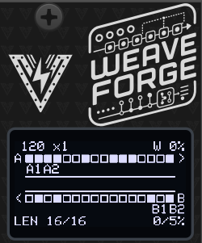

The home screen is **the loom**: both registers, the weave between them, and
where every output is reading.

**The two rows are the registers, and they run in opposite directions** —
register A left to right, register B right to left. That is not decoration. At
WEAVE 100 % the chain becomes a visible racetrack: a bit leaves A's right end,
crosses down through the channel, travels back along B, and comes up into A's
left end. You can follow one round it with a finger.

Each cell is one bit:

| Drawn        | Means                               |
| ------------ | ----------------------------------- |
| filled block | bit = 1, inside the active length   |
| hollow block | bit = 0, inside the active length   |
| small dot    | past the feedback point — see below |

So **LENGTH is a boundary you can see**, not a number to read: the point where
blocks turn into dots. The dots are still moving, and an output rotated out
there is still reading them — but they are not part of the loop. They are a
running copy of what has passed through the feedback point, which is why they
are drawn small.

**The channel between the rows is the weave.** At 0 % it is two flat parallel
rails with nothing crossing. As WEAVE comes up, strands appear crossing between
them, more of them the higher it goes, until at 100 % it is a full braid. The
arrowheads follow DIR, so a one-way weave shows strands going one way only.

**The labels under each row are the output jacks**, sitting at the cell they
read. `A1` and `A2` under register A's row mean those two jacks are reading it.
A label boxes while its jack's gate or trigger is high, so you can see which
outputs are speaking as well as where they read from. Note and modulation
outputs have a value at all times, so they never box — their label is a map, not
a blinker. Set a jack's ROTATE and watch its label walk along the row.

**Header:** tempo on the left (with an `E` when an external clock is running),
then the clock rate; weave amount on the right.
**Status line:** the two lengths, and the two probabilities.

Turning **LENGTH, CHANCE, WEAVE, DIR, BPM, RATE, DEPTH or ROTATE** hands the
screen back to the loom while you adjust, with the value in a strip along the
bottom — so the number and its effect are visible at the same time. It returns
to the page a few seconds after you stop.

## Menu map

Click the encoder to enter a value, turn to change it, click again to leave.

| Page                      | Rows                                                |
| ------------------------- | --------------------------------------------------- |
| **home**                  | the loom                                            |
| **REG A**                 | LENGTH · CHANCE · RANDOMIZE · INVERT · CLEAR · FILL |
| **REG B**                 | as A                                                |
| **WEAVE**                 | AMOUNT · DIR                                        |
| **CLOCK**                 | BPM · IN PPQN · RATE                                |
| **SCALE**                 | ROOT · SCALE · TRANSPOSE                            |
| **ROUTING**               | ROUTING                                             |
| **OUT A1 / B1 / A2 / B2** | SOURCE · TYPE · DEPTH · ROTATE · + two more         |
| **CV IN**                 | IN2 DEST · IN2 DEPTH · IN3 DEST · IN3 DEPTH         |
| **SETTINGS**              | TIMEOUT · BOOT MENU                                 |
| **PRESETS**               | SLOT · SAVE · LOAD · RANDOM                         |

## REG A / REG B

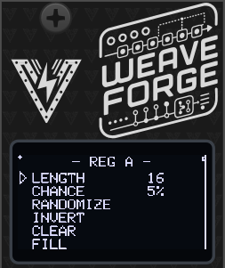

The two registers are identical and independent. Everything here applies to
both.

**LENGTH** (2–16) — how many bits are in the loop. The bit at position
LENGTH−1 is the one fed back round to the start, so LENGTH is the number of
steps before the pattern comes round again.

**CHANCE** (0–100 %) — the probability that the bit coming round the loop flips
on the way. This one control is the whole character of the module, and _both
ends of it are settings_, not extremes to avoid:

| CHANCE  | What you get                                                 |
| ------- | ------------------------------------------------------------ |
| 0 %     | **Locked.** The pattern repeats every LENGTH steps, forever. |
| 10–30 % | A loop that changes a note now and then.                     |
| ~50 %   | Maximum drift — a new sequence every time round.             |
| 100 %   | **Locked, inverting.** A pattern _twice_ LENGTH long.        |

That last row is worth knowing: always-flip is exactly as deterministic as
never-flip. At LENGTH 16 and CHANCE 100 you get a locked 32-step phrase.

**RANDOMIZE** rolls new bits for this register. **INVERT** flips all sixteen —
the same rhythm inside out. **CLEAR** and **FILL** set them all to 0 or 1, which
are the two starting points to hand-build from once the bit editor lands.

> **Shortening LENGTH is destructive.** The region above the feedback point is
> overwritten within a few clocks, so turning LENGTH back up does not bring the
> longer pattern back. If you like a pattern, save it to a slot — the register
> contents are stored in the preset, which is the only way to keep one.

## WEAVE

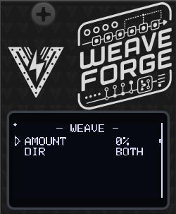

The module's signature control, and the one the screen draws literally.

**AMOUNT** (0–100 %) — the probability, evaluated fresh for each register on
every clock, that its incoming bit is taken from the _other_ register's outgoing
bit instead of its own. CHANCE still applies afterwards, to whichever bit was
chosen.

| AMOUNT | Behaviour                                                       |
| ------ | --------------------------------------------------------------- |
| 0 %    | Two unrelated Turing Machines that happen to share a clock.     |
| ~50 %  | Motifs leak across and drift back — related, never identical.   |
| 100 %  | The tails swap every clock: one ring, as long as both together. |

At 100 % with both lengths at 16 that is a locked 32-step phrase spread across
two outputs — something no amount of turning a single Turing Machine's knob will
give you. The two lengths do not have to match: 5 and 3 chain into a ring of 8.

**DIR** — `BOTH`, `A▸B` or `B▸A`. One-way is the most useful of the three in
practice: with `A▸B`, register B becomes a variation on A that cannot
contaminate it. A stays the theme; B is the answer.

## CLOCK

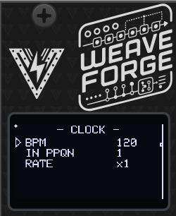

**BPM** (20–300) — the internal tempo, used whenever no external clock is
running. When one _is_ running, this row shows the derived tempo with an `E`
after it, and the number you set is remembered for when the cable comes out.

**IN PPQN** (1, 2, 4, 8, 24) — how many pulses the clock arriving at IN 1 sends
per beat. This is a description of your clock source, not a setting that changes
the sequencer: 4 means you are feeding it sixteenth notes. It does nothing when
the internal clock is running.

**RATE** — steps per beat, and it means the same thing whether the tempo comes
from IN 1 or from BPM:

| RATE                           | One step every…           |
| ------------------------------ | ------------------------- |
| `/16` `/8` `/6` `/4` `/3` `/2` | 16, 8, 6, 4, 3 or 2 beats |
| `x1`                           | beat — the tempo as set   |
| `x2` `x3` `x4` `x6` `x8` `x16` | 1/2, 1/3, 1/4 … of a beat |

`x1` is the tempo on the header, so the module boots stepping at exactly the
number it displays. The table is symmetric, so a click one way is the mirror of
a click the other. Multiplied steps are locked to the incoming clock's beat
rather than free-running, so they stay in time as the tempo moves.

The sequencer keeps playing on its internal tempo if the external clock stops or
is unpatched.

## SCALE

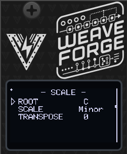

Applies to every NOTE output; there is one scale for the whole module, which is
what makes two note outputs sound like one instrument rather than two.

**ROOT** (C–B) and **SCALE** — chromatic, major, minor, the modes, both
pentatonics, harmonic and melodic minor, whole tone, diminished and blues.
Together they build the set of notes the outputs can land on.

**TRANSPOSE** (−24 to +24 semitones) — shifts every note output.

## ROUTING

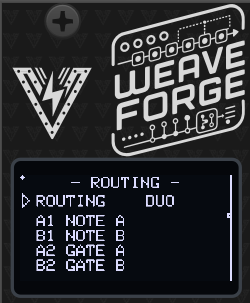

One row, and it is the fastest way to change what the module _is_. Picking a
layout configures all four jacks at once, and the four lines below the row show
what it did.

| ROUTING | A1     | B1             | A2     | B2             | The module is…                 |
| ------- | ------ | -------------- | ------ | -------------- | ------------------------------ |
| `DUO`   | NOTE A | NOTE B         | GATE A | GATE B         | two voices                     |
| `MONO`  | NOTE A | GATE A         | MOD A  | MOD B          | one voice plus two modulations |
| `PULSE` | TRIG A | TRIG A (rot 8) | TRIG B | TRIG B (rot 8) | a four-track drum machine      |

**Picking a layout stamps the jacks and then steps out of the way.** Every field
on every OUT page stays editable afterwards, and once you change one this row
reads `CUSTOM`. Bring the jacks back into line with a layout and it names that
layout again — nothing is remembering that you edited anything.

Each layout keeps WEAVE meaningful: in DUO it merges two voices into one long
shared phrase, in MONO it slides the second modulation from unrelated to locked
with the melody, and in PULSE it merges two independent drum patterns into one.

## OUT A1 / B1 / A2 / B2

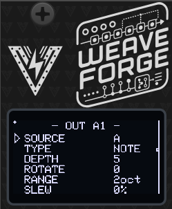

One page per jack, six rows each. The last two change meaning with TYPE.

**SOURCE** — `A`, `B`, or `AB`. `AB` is the two registers as one 32-position
ring, which is what WEAVE at 100 % actually makes them.

**TYPE**

| TYPE   | Emits                                                               |
| ------ | ------------------------------------------------------------------- |
| `NOTE` | A quantized pitch, 1 V/oct.                                         |
| `MOD`  | A stepped voltage — the original Turing Machine's main CV output.   |
| `GATE` | High while the jack fires, low at the first step where it does not. |
| `TRIG` | A fixed-width pulse each time the jack fires.                       |

**DEPTH** (1–8 bits) — how many bits this jack reads. More bits, finer
resolution.

**ROTATE** — where in the register it reads. This is the highest-value control
on the page: four jacks tapping the _same_ register at different offsets are
four phase-shifted copies of one pattern. Set a gate four steps behind its note
and you have a canon; do it across a drum kit and you have four tracks that
cannot drift apart. Its range follows SOURCE — 0–15 for a single register, 0–31
for `AB`.

**Fifth row, per TYPE:**

- `NOTE` ▸ **RANGE** (1–5 octaves) — the span the pattern is spread across.
  DEPTH sets resolution and RANGE sets span, so the two stay independent: 3 bits
  over 2 octaves is a sparse, singable line; 7 bits over the same 2 octaves
  wanders finely through it.
- `MOD` ▸ **LEVEL** (0–100 %) — output scaling.
- `GATE` / `TRIG` ▸ **THRESH** (0–100 %) — how often it fires. The bits are
  compared against this threshold rather than a single bit being read, so a gate
  output has a _density_ control: 12 % is a sparse kick, 88 % a busy hat — and
  both are still locked to the same register as the melody. At DEPTH 1 and
  THRESH 50 % it is exactly the classic behaviour.

**Sixth row, per TYPE:**

- `NOTE` / `MOD` ▸ **SLEW** (0–100 %) — glide between values.
- `TRIG` ▸ **WIDTH** — pulse length in milliseconds.
- `GATE` has no sixth parameter and shows `-`.

## CV IN

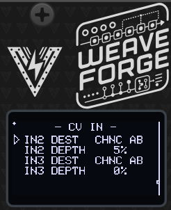

**IN2 DEST / IN3 DEST** — what that input modulates:

| Destination                 | Notes                                               |
| --------------------------- | --------------------------------------------------- |
| `OFF`                       | nothing                                             |
| `LEN A` `LEN B` `LEN AB`    | pattern length                                      |
| `CHNC A` `CHNC B` `CHNC AB` | probability                                         |
| `WEAVE`                     | the coupling                                        |
| `TRANS`                     | transposition of every note output                  |
| `ROTATE`                    | every jack's rotation together — moves all the taps |
| `RESET`                     | gate: restarts both patterns from a known state     |
| `LOCK`                      | gate: holds the patterns while high                 |

**IN2 DEPTH / IN3 DEPTH** (0–100 %) — how much. Length, probability and weave
are _trims_ around whatever the menu is set to, so a centred CV leaves the panel
setting alone.

`RESET` and `LOCK` act on the level of the input and ignore depth. `LOCK` forces
probability to zero while it is high, which is the quickest way to freeze a
phrase from outside the module, and it wins over a CHANCE knob at 100 %.

## SETTINGS

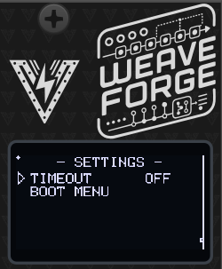

**TIMEOUT** — how long the menu waits before dropping back to the loom: `OFF`,
2, 5, 10 or 20 seconds.

**BOOT MENU** — returns to the module selector, the same as holding the encoder
for two seconds. The selector is also the only way into the calibration wizard.

## PRESETS

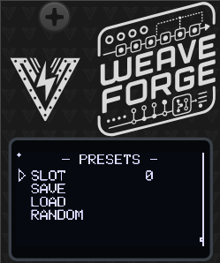

Ten slots. **Slot 0 is loaded automatically at power-on**, so save the patch you
want to start with there.

**SLOT** picks the slot; **SAVE** and **LOAD** do what they say. A dot in the
top-left corner of the screen means the live state differs from what is stored.

**RANDOM** rolls a new patch: new bits in both registers, new lengths and
probabilities, a new weave. It deliberately leaves the output routing, the CV
destinations, the scale and the clock alone — those are decisions you made on
purpose, and rerolling them would turn "give me a new phrase" into "break my
patch". It does not write a slot, so a saved patch is one LOAD away.

**The register contents are part of a preset**, not just the settings. That is
the point: a preset that restored the right length and the wrong bits would have
restored nothing you cared about.

## Patch ideas

- **Two voices, converging.** DUO, both lengths at 16, CHANCE around 25 %. Take
  A1/A2 to one voice and B1/B2 to another, then bring WEAVE up slowly from zero.
  Two unrelated lines pull together into one long phrase spread across both
  voices. This is the module in one knob.
- **Theme and answer.** DIR `A▸B`, WEAVE around 60 %. B follows A and can never
  disturb it.
- **A drum machine off the bass line.** PULSE, then set THRESH per track — low
  for the kick, high for the hats. The rhythm and the melody come from the same
  register, so they are locked together by construction.
- **Canon.** DUO, then set A2's ROTATE to 4. The gate plays the pattern four
  steps behind the note.
- **Keep one.** Let it drift until something good goes past, pull CHANCE to 0 to
  freeze it, and save the slot. Or patch `LOCK` and freeze it with a footswitch.
- **A very long loop.** Both lengths 16, WEAVE 100 %, CHANCE 0. One locked
  32-step phrase. Set CHANCE to 100 instead for a 64-step one.

## In VCV Rack

The Rack module runs the same firmware against a hardware shim, with the OLED
emulated pixel for pixel, so it behaves identically to the panel.

Drag the encoder to scroll and click to select. With the mouse over the module,
`[` and `]` turn the encoder one detent and `space` clicks it.

Everything on the panel is also on the right-click menu — Weave, both registers
with their pattern actions, the output matrix, clock, scale and CV routing —
with real sliders and option lists instead of relayed encoder turns. The context
menu also carries an input CV range setting (0–5 V like the hardware, ±5 V or
0–10 V) and an encoder sensitivity setting.

Saving a Rack patch stores the live state, including the patterns themselves, so
a reloaded patch plays the phrase you left it on.

## Hardware Calibration

The module ships with sensible default values, but for best precision —
especially when using the quantized note outputs — you should run the hardware
calibration wizard once after building or assembling the module.

Calibration covers two things:

**Output trim**: the output op-amp gain is set with on-board trimmers so every output jack delivers exactly 5.00 V at full scale. This is purely a hardware adjustment — there is no software output scaling.
**CV input calibration**: each CV input is measured at two known reference voltages (1 V and 3 V) to build a per-channel linear correction (`mv = scale × reading + offset`) that compensates for resistor tolerances and ADC offset. This is done with external references and is independent of the module's own outputs, so any output-trim error does not propagate into the input calibration.

Calibration data is stored in a dedicated area of non-volatile memory **separate from presets**, so it survives firmware updates and preset load/save operations.

### What you need

- A multimeter capable of measuring DC voltage to at least two decimal places (for the output trim).
- A stable, known **1 V** and **3 V** source for the CV inputs — for example a precision voltage reference, a bench power supply, or a calibrated sequencer/quantizer output — and a patch cable to connect it.

### Running calibration

The wizard has 5 steps: one output trim followed by four CV input captures (1 V and 3 V on each of the two inputs).

1. Power on the module **from your Eurorack supply** while **holding the encoder button** pressed, which opens the module selector. Release the button, scroll to **CALIBRATE** at the bottom of the list and click. (From a running module you can get to the same screen with **SETTINGS → BOOT MENU**, or by holding the encoder for two seconds.) Click the encoder at the welcome screen to start.

   Calibration belongs to the board, not to any one module: one run covers every module in the firmware, and the wizard reboots back to the selector when it is done.

   > ⚠️ Calibrate on Eurorack power, **not** the MCU's USB port — USB cannot drive the outputs to full scale, so the trim would be wrong. **Never connect Eurorack power and USB at the same time, as this could damage the module.**

2. **Step 1 — Output trim** (`1/5  OUTPUT TRIM`):
   All four outputs are driven to full scale. Using a multimeter set to DC voltage, probe each output jack in turn and adjust its corresponding trimmer potentiometer on the PCB until the reading is exactly **5.00 V**. When all four outputs read 5.00 V, press the encoder to continue.

3. **Steps 2–5 — CV input capture** (`2/5` … `5/5`):
   The display asks for a specific reference voltage on a specific input, in turn:
   - `2/5  CV1 INPUT 1V` — apply **1 V** to CV input 1
   - `3/5  CV1 INPUT 3V` — apply **3 V** to CV input 1
   - `4/5  CV2 INPUT 1V` — apply **1 V** to CV input 2
   - `5/5  CV2 INPUT 3V` — apply **3 V** to CV input 2

   For each step, apply the requested voltage to the named input. The screen shows a live voltage reading so you can confirm the signal is stable; when it is steady, press the encoder to capture (256 ADC samples are averaged). Repeat for all four steps.

4. **Review and save**:
   The display shows the derived per-channel scale and offset for a sanity check. Press the encoder to **save and reboot**. The module restarts with calibration applied.

> **Tip:** Calibration only needs to be run once. Re-run it if you replace any resistors or trimmers on the board, or if CV tracking feels off after assembly.

## Firmware Update

1. Download the latest firmware from the Releases section of the [GitHub repository](https://github.com/VoltageFoundryMod/ForgeSeries/releases).
2. Connect the module to your computer using a USB-C cable while holding the small BOOT (B) button. The CPU can be removed from the module as it's socketed to the main board if desired. Firmware loading can be done with the CPU removed.
3. A new drive will show on your computer named RPI-RP2. Copy the `.uf2` file to the module USB drive. After copy is finished, the module will reboot and the new firmware will be loaded.

## Troubleshooting

- **No Power**: Ensure the module is properly connected to the power supply and the power jumper is set correctly.
- **Nothing happens**: This module does not run without a clock. Patch one to IN 1, or check that the CLOCK page's BPM is set — the internal clock takes over whenever no external one is arriving.
- **The pattern never changes**: CHANCE is at 0 on both registers, or a `LOCK` gate is high on one of the CV inputs. Both are deliberate freezes.
- **The pattern will not settle**: CHANCE near 50 % is maximum drift. Come down to 10–30 % for a loop that changes occasionally, or to 0 to lock it.
- **A gate output fires constantly or never**: check that jack's THRESH — it is a density control, and 0 % and 100 % are silence and a solid gate.
- **Note outputs are all the same pitch**: check RANGE on that jack, and that the scale has more than one note enabled.

## Powering

The module uses only 5V internally. This can be provided directly by a Eurorack supply with a 5V rail, or taken from the 12V line and converted to 5V on-board. The source is selected with an on-board jumper: closing the center pin to **INT REG** takes power from the Eurorack 12V supply, while closing the center pin to **EURO** takes power from the 5V rail (requires a 16-pin cable). It can also be powered from the USB-C jack on the microcontroller board.

**Never connect both the Eurorack power and the USB-C power at the same time**. The module might be damaged or even damage your computer if both are connected. The module is designed to be powered from either source, not both.

## Specifications

- **Power Supply**: 12V or 5V jumper selectable
- **Input CV Range**: 0–5V
- **Output CV Range**: 0–5V
- **Dimensions**: 6HP
- **Depth**: 40mm
- **Current Draw**: 60mA @ +12V or +5V

## Contact

For support and inquiries, please open an issue on the [GitHub repository](https://github.com/VoltageFoundryMod/ForgeSeries).

## Acknowledgements

The shift register is Tom Whitwell's [Turing Machine](https://www.musicthing.co.uk/Turing-Machine/),
by way of Hemisphere Suite's ShiftReg. The assignable output matrix is the good
idea from Phazerville's [Enigma](https://firmware.phazerville.com/Enigma).
Thanks for the inspiration!

## License

This project is licensed under the MIT License. See the `LICENSE` file for more information.
