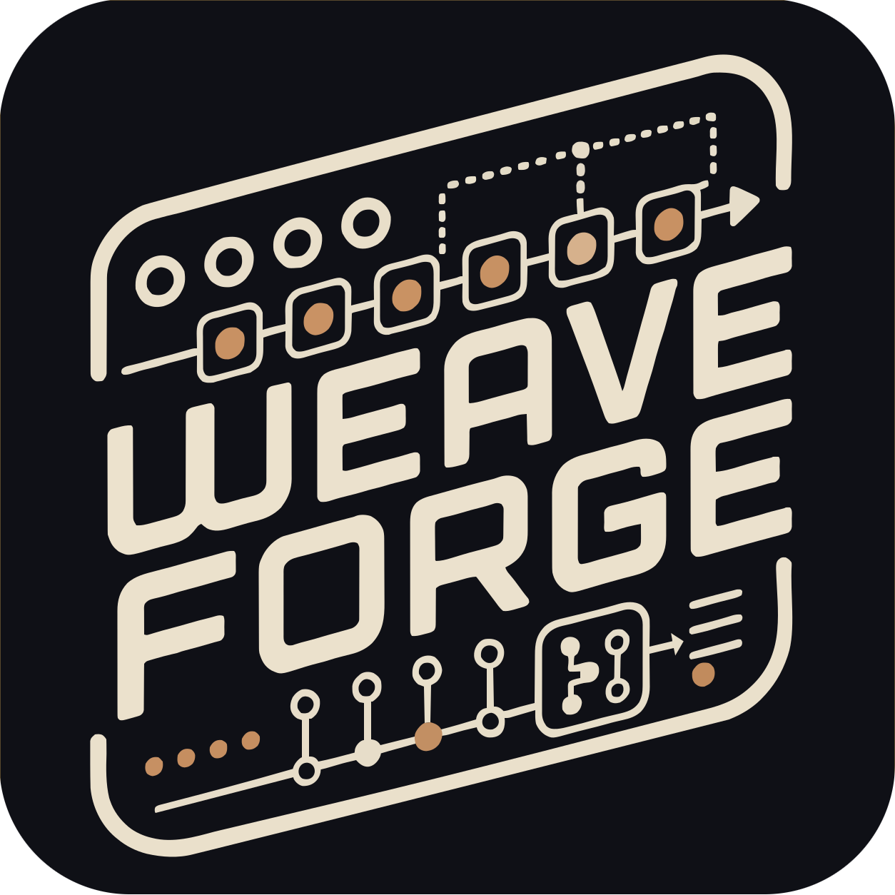

# WeaveForge: Two Turing Machines That Trade Bits



**Dual shift-register sequencer.** Two Turing Machines run side by side like a
pair of threads on a loom — each one a ring of bits that loops, drifts or
dissolves into noise under a single probability control. **WEAVE** decides how
much of each thread's next bit is taken from the _other_, sliding from two
unrelated sequencers, through motifs leaking across and drifting back, to one
ring as long as both together. The screen draws the braid as it tightens.

Inspired by the [Turing Machine](https://www.musicthing.co.uk/Turing-Machine/),
Hemisphere Suite's ShiftReg, and the output-assignment idea from Phazerville's
[Enigma](https://firmware.phazerville.com/Enigma).

[Design notes](docs/Design.md) hold the concept and the reasoning behind every
architectural decision.

---

## The controls

| Control    | Does                                                                |
| ---------- | ------------------------------------------------------------------- |
| **LENGTH** | 2–16, per register. Where the ring feeds back.                      |
| **CHANCE** | 0–100 %, per register. Whether the wrapping bit flips.              |
| **WEAVE**  | 0–100 %. How much each register's next bit comes from the other.    |
| **DIR**    | `BOTH` · `A▸B` · `B▸A`. Who feeds whom.                             |
| **RATE**   | `/16` … `x1` … `x16` steps per beat, on internal or external clock. |

### CHANCE is the original module's knob, unrolled

Both ends of CHANCE are settings, not extremes to avoid:

| CHANCE  | Result                                              |
| ------- | --------------------------------------------------- |
| 0 %     | Locked. Repeats every LENGTH steps, forever.        |
| 10–30 % | A loop that changes a note now and then.            |
| ~50 %   | Maximum drift — a new sequence every pass.          |
| 100 %   | Locked, inverting: a pattern **twice** LENGTH long. |

That last one is the old Turing Machine trick, and it works here: always-flip is
exactly as deterministic as never-flip.

### WEAVE

| WEAVE | Behaviour                                                     |
| ----- | ------------------------------------------------------------- |
| 0 %   | Two unrelated Turing Machines sharing a clock.                |
| ~50 % | Motifs leak across and drift back — related, never identical. |
| 100 % | One ring, as long as both registers put together.             |

`A▸B` is the one to reach for when you want a theme and an answer: register B
becomes a variation on A that cannot contaminate it.

## Jacks

| Jack              | Role                                                                         |
| ----------------- | ---------------------------------------------------------------------------- |
| **IN 1**          | Clock. Always — there is no role menu, see below.                            |
| **IN 2/IN 3**     | Assignable modulation: LENGTH, CHANCE, WEAVE, TRANSPOSE, ROTATE, RESET, LOCK |
| **A1 B1 / A2 B2** | Four outputs. What each one _is_ depends on ROUTING.                         |

IN 1 has no role menu because a shift register has no life between clocks —
unclocked, the module is a static voltage. An internal clock covers the
unpatched case; RESET and the ShiftReg unlock-gate trick are CV targets instead.

### ROUTING

The four jacks are a matrix — each picks a SOURCE (register A, B, or the woven
32-bit ring), a TYPE, how many bits to read and where to read them. ROUTING is a
one-click macro over all four:

| ROUTING | A1     | B1             | A2     | B2             | The module is…                         |
| ------- | ------ | -------------- | ------ | -------------- | -------------------------------------- |
| `DUO`   | NOTE A | NOTE B         | GATE A | GATE B         | two voices                             |
| `MONO`  | NOTE A | GATE A         | MOD A  | MOD B          | one voice + two correlated modulations |
| `PULSE` | TRIG A | TRIG A (rot 8) | TRIG B | TRIG B (rot 8) | the Pulses expander, in software       |

Picking one stamps the four slots and steps out of the way — every field stays
editable, and the menu then reads `CUSTOM`. Each register owns a column of the
panel in DUO: A down the left, B down the right.

**ROTATE** is where a jack reads in the ring, and it is the most musical control
per line of code in the module: four jacks tapping the _same_ register at
different offsets are four phase-shifted copies of one pattern — canons, rounds,
a bass line and its own echo four steps late.

**THRESH** on GATE and TRIG compares the window against a threshold instead of
reading one bit, so a gate output has a density control: 12 % is a sparse kick,
88 % a busy hat, both locked to the same register as the melody.

## The screen

The home screen is the loom: the two registers as rows of cells running in
opposite directions, with the weave drawn in the channel between them. Filled
cell = 1, hollow = 0, small dot = past the feedback point. At WEAVE 100 % the
chain is a visible racetrack — out of A's right end, down through the channel,
back along B, up into A's left end.

Each jack's panel name sits at the cell it reads, so ROTATE is something you
watch rather than a number you read, and a jack's label boxes while its gate is
high.

Turning LENGTH, CHANCE, WEAVE, DIR, BPM, RATE, DEPTH or ROTATE hands the screen
to the loom with the value in a strip along the bottom.

## Patch ideas

- **Two voices.** DUO, both LENGTHs at 16, CHANCE around 25 %, then bring WEAVE
  up slowly. Two independent lines converge into one long phrase spread across
  both voices. This is the module's whole proposition in one knob.
- **Theme and answer.** DIR `A▸B`, WEAVE around 60 %. B follows A without ever
  being able to disturb it.
- **A drum machine off the bass line.** PULSE, then set THRESH per track. The
  rhythm and the melody are the same register, so they cannot drift apart.
- **Canon.** DUO, then set A2's ROTATE to 4. The gate plays the same pattern
  four steps behind the note.
- **Keep one.** Let it drift until something good goes past, pull CHANCE to 0,
  and save the slot — the register contents are part of the preset, which is the
  only way to keep a pattern.

## Building

Nothing module-specific. From the repository root:

```sh
make            # the unified firmware — every module
make fw-wea     # just WeaveForge
make test-wea   # its native tests
make wea        # its standalone VCV Rack plugin, installed into Rack
```

## License

MIT. The consolidated VCV Rack plugin is distributed under the VCV Rack EULA, as
required for publication in the VCV library.
