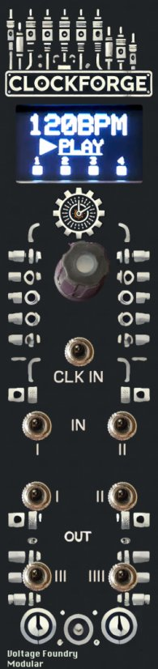
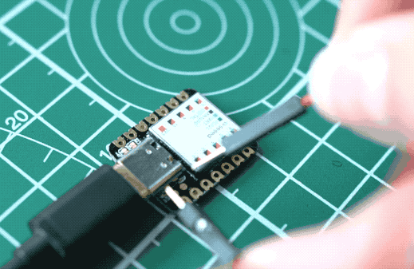

# ClockForge 2: Crafting Time, One Pulse at a Time

## Overview

ClockForge provides clock signals and waveforms for synchronizing and modulating other modules in your Eurorack system. It features a global BPM control, multiple clock outputs, adjustable clock multiplication and division per output, tap tempo functionality, sync to external clock sources, Euclidean rhythm generation, CV Input modulation matrix and custom swing patterns per output.

Part of the **Forge** series of modules which share a single hardware platform. The new ClockForge 2 is an updated version with a more powerful microcontroller and 4 outputs that can generate waveforms, envelopes and all.

[ModularGrid](https://modulargrid.net/e/other-unknown-clockforge-by-voltage-foundry-modular)

## Features

- **Global BPM Control**: Set the global BPM for all outputs.
- **Multiple Clock Outputs**: Four clock outputs with individual settings.
- **Adjustable Clock Multiplication and Division**: Configure each output to multiply or divide the global BPM.
- **Output Waveform Generation**: Outputs can generate different waveforms for modulation.
- **Pulse Probability**: Set the probability of a pulse occurring.
- **Euclidean Rhythm Generation**: Generate complex rhythms using Euclidean algorithm.
- **Custom Swing Patterns**: Apply swing to each output individually.
- **Sync to External Clock Sources**: Automatically adjust BPM based on an external clock signal with adjustable clock divider.
- **Phase Shift**: Adjust the phase of the output in relation to the master clock.
- **Waveform Duty Cycle and Level/Offset**: Adjust the pulse width and level/offset of the clock signal.
- **External modulation**: Many parameters can be modulated by the CV inputs by assigning CV targets.
- **Tap Tempo Functionality**: Manually set the BPM by tapping a button.
- **Quantization**: Quantize the output wave or CV input to some scale and root note.
- **Envelopes**: Outputs can generate different types of envelopes (AD, AR, ADSR) triggered by CV inputs.
- **Save/Load Configuration**: Save and load up to 5 configurations.

The module has a user-friendly interface with an encoder for navigation and parameter adjustment, and a clear display showing the current settings and status of each output. The main screen shows the BPM and the status of each output, while navigating into each output's settings allows for detailed configuration of that specific output. There are no submenus as all parameters are accessible by scrolling horizontally on the same menu screen.

The right side of the screen shows a navigation line to indicate the current position of the cursor in the menu. The navigation is not shown in the main (BPM) screen.

Whenever a parameter is changed, a small circle will be shown in the top-left corner of the screen. This indicates that the current settings were modified and not saved. The module always loads the preset saved in slot 0 on boot.

----------------------------------------------------------------------------

## User Manual

- [ClockForge 2: Crafting Time, One Pulse at a Time](#clockforge-2-crafting-time-one-pulse-at-a-time)
  - [Overview](#overview)
  - [Features](#features)
  - [User Manual](#user-manual)
    - [Global Parameters](#global-parameters)
    - [Output Parameters](#output-parameters)
  - [Operation](#operation)
    - [Interface](#interface)
    - [Setting the BPM](#setting-the-bpm)
    - [Global Play/Stop](#global-playstop)
    - [Output clock division/multiplication](#output-clock-divisionmultiplication)
    - [Output Enable/Disable](#output-enabledisable)
    - [Pulse Probability](#pulse-probability)
    - [Euclidean Rhythm Configuration](#euclidean-rhythm-configuration)
    - [Swing Configuration](#swing-configuration)
    - [Output Phase Shift](#output-phase-shift)
    - [Duty Cycle (pulse width)](#duty-cycle-pulse-width)
    - [Output Level and Offset](#output-level-and-offset)
    - [Output Waveform](#output-waveform)
    - [Envelopes](#envelopes)
    - [Tap Tempo](#tap-tempo)
    - [CV Input Modulation](#cv-input-modulation)
    - [Quantization](#quantization)
    - [Misc Settings](#misc-settings)
    - [Save/Load Configuration](#saveload-configuration)
    - [External Clock Sync](#external-clock-sync)
  - [Hardware Calibration](#hardware-calibration)
    - [What you need](#what-you-need)
    - [Running calibration](#running-calibration)
  - [Firmware Update](#firmware-update)
  - [Troubleshooting](#troubleshooting)
  - [Powering](#powering)
  - [Specifications](#specifications)
  - [Contact](#contact)
  - [Development](#development)
  - [Acknowledgements](#acknowledgements)
  - [License](#license)

### Global Parameters

- **BPM**: Beats per minute, adjustable from 10 to 300.
- **Master Stop**: Stop or resume all outputs.

The small squares on main screen shows the status of each output. If the square is filled, the output is active. If the square is empty, the output is stopped.

### Output Parameters

Each of the four outputs can be individually configured with the following parameters:

- **Divider/Multiplier**: Set the clock multiplication or division ratio.
- **Output State**: Enable or disable the specific output.
- **Pulse Probability**: Probability of a pulse occurring.
- **Euclidean Enabled**: Enable or disable Euclidean rhythm generation.
- **Euclidean Steps**: Number of steps in the Euclidean pattern.
- **Euclidean Triggers**: Number of triggers in the Euclidean pattern.
- **Euclidean Rotation**: Rotate the Euclidean pattern.
- **Euclidean Pad**: Add empty steps to the end of the Euclidean pattern.
- **Swing Amount**: Adjust the swing amount for the output.
- **Swing Every**: Set the pulse interval for applying swing.
- **Phase Shift**: Adjust the phase of the output in relation to the master clock.
- **Duty Cycle**: Adjust the pulse width of the clock signal.
- **Level**: Set the output voltage level.
- **Offset**: Set the output voltage offset.
- **Waveform**: Select the waveform for outputs.
- **Quantization**: Quantize the output to a specific scale and root note.

## Operation

### Interface

- TRIG: Optional Clock input (0-5V)
- IN1, IN2: CV input to control internal parameters via matrix (0-5V)
- OUT 1 / 2/ 3 / 4: Outputs which are waveform capable (0-5V)

### Setting the BPM

1. Use the encoder to navigate to the BPM setting.
2. Push the encoder to enter edit mode.
3. Rotate the encoder to adjust the BPM value.
4. Press the encoder to exit edit mode.

### Global Play/Stop

With the **PLAY** or **STOP** word underlined, press the encoder button to stop or resume all outputs. The individual outputs can still be stopped or resumed individually and will remain in the last state set.

### Output clock division/multiplication

Outputs can be configured to multiply or divide the master clock. The default value is 1x which means the output will be in sync with the master clock. The outputs can be multiplied up to 64x or divided down to /128 with some triplets and dotted notes in between in the "1.5" and "3" division and multiplier values.

1. Navigate to the selected output.
2. Click the encoder to enter edit mode.
3. Use the encoder to select the desired divider value.
4. Click the encoder to exit edit mode.

### Output Enable/Disable

Outputs can be stopped individually. When stopped, the output will not generate any pulses. When master stop is activated, all outputs will be stopped and when master play is resumed, any stopped output will be kept stopped.

1. Navigate to the output state menu page.
2. Click the encoder to set the output to ON or OFF

If the output wave type is set to "Play", the output will be true (high) when the master clock is running and false (low) when the master clock is stopped. This is useful for triggering other modules based on the master clock.

If the output wave type is set to "Reset", the output will trigger (high) when the master clock starts running. This is useful for resetting other modules based on the master clock.

### Pulse Probability

This is the percentage of probability that a pulse will be generated on the output. This is useful for creating random patterns or adding some variation to the output.

1. Navigate to the probability menu page.
2. Click the encoder to enter edit mode on the selected output.
3. Use the encoder to select the desired pulse probability in percentage.
4. Click the encoder to exit edit mode.

### Euclidean Rhythm Configuration

Euclidean rhythms are made from an algorithm which takes a numbers of steps, triggers(HITS) which are active steps and rotation(RT) of this pattern and produces a rhythm based the on hits being as equidistant from each other as possible. See <https://en.wikipedia.org/wiki/Euclidean_rhythm> for more info.

Additional empty steps can be added to the pattern using the pad(PD) parameter. This is useful for creating more complex rhythms.

1. Navigate to the euclidean rhythm menu page. 
2. Select the output item and click the encoder to select the output to be edited. Click the encoder again to exit the output selection.
3. First setting enables or disables the Euclidean rhythm generation by clicking the encoder.
4. Select the Steps, Triggers and Rotation parameters, click the encoder to edit the values.
5. The pattern will be updated in real-time and displayed on the right of the screen. Euclidean rhythm allows up to 64 steps but only the first 47 are displayed. Rhythm steps are shown in columns, top to bottom, left to right.

The euclidean rhythm pulse is affected by the pulse probability setting.

### Swing Configuration

The outputs can have a swing pattern applied to them. The swing amount is in 1/96th of a note based on current BPM and the swing every is the interval between applying the swing. The swing amount can be set from 2/96th to 12/96th delay and the swing every from 1 to 16 pulses.

1. Navigate to the selected output. The first parameter to be edited is the swing amount.
2. Click the encoder to enter edit mode.
3. Use the encoder to select the desired swing amount.
4. Click the encoder to exit edit mode.
5. Navigate to the selected output, the second parameter to be edited is the swing every.
6. Click the encoder to enter edit mode.
7. Use the encoder to select the desired swing every value.
8. Click the encoder to exit edit mode.

### Output Phase Shift

Outputs can have their phase adjusted in percentage in relation to the master pulse. This allows for phase shifting the output in relation to the master clock. The default value is 0% which means the output is in phase with the master clock.
An adjstment of 50% will shift the output by half a pulse width which means that this output will hit in the upbeats of the master clock (or an output with a 0% phase shift).

Just be careful with phase wraps as shifting an output phase by more than 50% with a duty-cycle bigger than 50% can lead to unexpected triggers.

### Duty Cycle (pulse width)

Duty cycle or width is the percentage of the pulse that remains high or low. The default value is 50% which means the pulse high cycle has the same lenght as the low cycle. The duty cycle can be set from 1 to 99% where 1% will generate a very short pulse and 99% a very long high pulse.

The alternative waveforms generated by outputs 3 and 4 can also have their shape modified by the duty cycle parameter. For example, a 50% duty cycle (default) in the triangle wave output will generate a perfect triangle wave, setting the duty cycle to 1% will generate a sawtooth wave and setting it to 99% will generate an inverted sawtooth wave. The duty cycle also affects the envelopes by shortening or lengthening the decay time during the pulse.

1. Select the duty cycle parameter for the desired output. Click the encoder to enter edit mode.
2. Use the encoder to select the desired duty cycle value from 1 to 99%.
3. Click the encoder to exit edit mode.

### Output Level and Offset

Allows setting the output level and offset which ranges from 0 to 100% corresponding to 0 to 5V.

1. Navigate to the selected output. Click the encoder to enter edit mode.
2. Use the encoder to select the desired output level from 0 to 100% which corresponds to 0 to 5V.
3. Click the encoder to exit edit mode.

### Output Waveform

Outputs can be configured to multiple waveforms and envelopes.

They support the following:

- **Square**: A square wave with adjustable duty cycle, level and offset.
- **Triangle**: A triangle wave with adjustable duty cycle, level and offset.
- **Sawtooth**: A sawtooth wave with adjustable duty cycle, level and offset.
- **Sine**: A sine wave with adjustable duty cycle, level and offset.
- **Parabolic**: A parabolic wave with adjustable duty cycle, level and offset.
- **Logarithm Envelope**: A logarithm envelope curve (starts at 0% raising to 100%) with adjustable level and offset. Triggered by clock pulses.
- **Exponential Envelope**: An exponential envelope curve (starts at 0% raising to 100%) with adjustable level and offset. Triggered by clock pulses.
- **Inverted Logarithm Envelope**: An inverted logarithm envelope curve (starts at 100% decaying to 0) with adjustable level and offset. Triggered by clock pulses.
- **Inverted Exponential Envelope**: An inverted exponential envelope curve (starts at 100% decaying to 0) with adjustable level and offset. Triggered by clock pulses.
- **Hatchet x2**: Generates 2 square pulses in one up clock cycle. The pulse width can be adjusted by the duty cycle parameter. Level and offset can also be adjusted.
- **Hatchet x4**: Generates 4 square pulses in one up clock cycle. The pulse width can be adjusted by the duty cycle parameter. Level and offset can also be adjusted.
- **Noise**: A random signal with adjustable level and offset. Continuous.
- **Smooth Noise**: A smooth random signal with adjustable level and offset. Continuous.
- **Sample & Hold**: A sample and hold signal based on noise with adjustable level and offset. Triggered by clock pulses.
- **AD Envelope**: An Attack-Decay envelope (no sustain while gate is held) with adjustable level and offset. Triggered by a CV input.
- **AR Envelope**: An Attack-Release envelope (sustain is held at max level while gate is on) with adjustable level and offset. Triggered by a CV input.
- **ADSR** Envelope: An Attack-Decay-Sustain-Release envelope with adjustable level and offset. Triggered by a CV input.
- **Play**: The output will be true (high) when the master clock is running and false (low) when the master clock is stopped. This is useful for triggering other modules based on the master clock.
- **Reset**: The output will trigger (high) when the master clock starts running. This is useful for resetting other modules based on the master clock.
- **Quantize**: The output will quantize according to the selected scale and root note the CV value that is routed to this input in the CV target configuration.

1. Navigate to the selected output item. Click the encoder to enter edit mode.
2. Use the encoder to select the desired waveform. The waveform will be updated in real-time.
3. Click the encoder to exit edit mode.

### Envelopes

The module supports envelope generators based on input CV triggers. Refer to the Output Waveform section for more information on the envelope types.

The AD, AR and ADSR envelopes can only be generated by using triggers/gates on the CV inputs. They can have configurable curves between logarithmic, linear and exponential and also allow retriggering while the envelope is still active. The other waveforms (square, sine, etc) cannot be triggered by CV inputs.

To set an envelope generation, follow these steps:

1. Go to the waveform selection like in previous section and choose between "AD Env", "AR Env" or "ADSR Env".
2. Then, go to CV Input target configuration, select which CV input will receive the gate/trigger and assign it to the Output X Env parameter.

Tip: You can have up to 2 envelopes running at the same time, as there are only 2 input CVs that can be assigned to the output. Each output can have it's own parameters like envelope type, levels, offsets, curves and retriggering settings.

### Tap Tempo

In addition to setting the BPM manually, the module can be set to the desired BPM by clicking the encoder. The module will calculate the BPM based on the interval between taps.

1. Select the tap tempo parameter.
2. Press the encoder button at least 3 times to set the BPM based on the interval between taps. If more than 3 taps are entered, the average time between the last 3 is used. BPM is updated in real-time.

### CV Input Modulation

Many parameters can be modulated by the CV inputs. The CV inputs are 0-5V and can be used on the modulation matrix to control the parameters below:

- **BPM**: Modulate the global BPM with a CV signal.
- **Output X Div**: Modulate the clock division/multiplication for output X.
- **Output X Prob**: Modulate the probability of a pulse occurring on output X.
- **Swing X Amount**: Modulate the swing amount for output X.
- **Swing X Every**: Modulate the pulse interval for applying swing on output X.
- **Output X Level**: Modulate the output voltage level for output X.
- **Output X Offset**: Modulate the output voltage offset for output X.
- **Output X Waveform**: Select the waveform for output X based on the input CV Value.
- **Output X Duty Cycle**: Modulate the duty cycle of the output X.
- **Output X Envelope**: Trigger the envelope generation for the output X by sending a gate/trigger signal to the assigned CV input.
- **Output X**: Send the input CV Value to the output X. This can be used for example to quantize an external CV and enabling the quantizer in the used output.

Each input can be assigned to one of the parameters above. The CV input can be attenuated or offset by using configuration parameters.

1. Navigate to the selected CV Input parameter.
2. Click the encoder to enter edit mode.
3. Use the encoder to select the desired parameter to be modulated.
4. Click the encoder to exit edit mode.
5. Optionally, navigate to the attenuation and offset parameters for each CV input and set the desired values in a similar way.

The CV target only apply to the selected parameter when the user exit the edit mode. This way a connected CV to an input does not change the scrolled parameters while the user is selecting the target.

### Quantization

The module supports quantization of the output to a specific scale and root note. The quantization can be applied to the output waveform or to the CV input.

The Quantize Settings menu allows you to enable/disable quantization for the selected output, choose the root note, scale to be used and octave transpose with 3 octave levels higher or lower.

To use quantization on the generated output, first select the output waveform type (sine, S&H, etc) and then enable the quantization on Quantize menu. Select the root note and scale to be used. The quantization will be applied to the output waveform.

It's also possible to quantize an input CV signal to a specific scale and root note. This is useful for using CV values generated by external modules. To use quantization on the CV input, choose the "Quantize" waveform type. Then in the Quantize menu, select the root note and scale to be used. Lastly, in the CV Input Targets menu, assign the CV input to the output to be quantized.

Eg. if you want to quantize the CV input 1 to the output 3, select the "Quantize" waveform type for output 3 and then in the CV Input Targets menu, assign CV input 1 to output 3. The quantization will be applied to the output waveform. Also select which scale and root note to be used in the Quantize menu.

### Misc Settings

**Main screen timeout**

The module can be set to return to the main screen (the one showing the BPM and the output boxes) after a certain amount of seconds of inactivity when not editing a parameter. When a parameter is being changed (selected), the timeout doesn't apply. This can be configured in the "Screen Timeout" menu where the options are Off, 2s, 5s, 10s and 20s.

### Save/Load Configuration

The module has 5 memory slots to save and load configuration. The parameters saved into slot 0 is automatically loaded on boot.

1. Navigate to the PRESET SLOT parameter.
2. Click the encoder to enter the desired slot selection.
3. Click to exit the slot selection.
4. Select SAVE and click the encoder to save the current slot configuration.
5. Select LOAD and click the encoder to load the selected slot configuration.

The "LOAD DEFAULTS" option will load the default configuration to current parameters but will not save it. To save the default configuration, navigate to the save configuration parameter and save it to the selected preset slot.

### External Clock Sync

1. Connect an external clock signal to the designated input.
2. The module will automatically adjust the BPM to match the external clock. A small "E" will be displayed on the screen next to BPM when the external clock is detected.
3. When the external clock is disconnected, the module will revert to the last used internal BPM.

If the external clock is faster than needed (for example running at higher PPQN), it's possible to apply an external clock divider (from no division to 48PPQN) to the input signal in the Clock Divider section.

The module works with external clocks from 30 to 300 BPM. Due to timer resolution, using very slow external clocks with high multipliers may lead to jitter on the outputs.

## Hardware Calibration

The module ships with sensible default values, but for best CV precision — especially when using quantization or 1V/oct pitch CV — you should run the hardware calibration wizard once after building or assembling the module.

Calibration is a two-phase process:

**Phase 1 — Output trim**: fine-tunes the output op-amp gain so every output jack delivers exactly 5.00 V at full scale.
**Phase 2 — CV input LUT**: maps 7 known voltages from the (now calibrated) outputs back through the voltage-divider input circuit, building a per-channel piecewise-linear correction table that compensates for resistor tolerances and RP2040 ADC non-linearity.

Calibration data is stored in a dedicated area of non-volatile memory **separate from presets**, so it survives firmware updates and preset load/save operations.

### What you need

- A multimeter capable of measuring DC voltage to at least two decimal places
- Two standard Eurorack patch cables

### Running calibration

1. Power on the module while **holding the encoder button** pressed. The display will show the calibration wizard. Release the button when you see the welcome screen.

2. **Step 1 — Output trim** (`1/3  OUTPUT TRIM`):
   All four outputs are driven to full scale (5 V). Using a multimeter set to DC voltage, probe each output jack in turn and adjust its corresponding trimmer potentiometer on the PCB until the reading is exactly **5.00 V**. Repeat for all four outputs.
   When all four outputs read 5.00 V, press the encoder to continue.

3. **Step 2 — Patch cables** (`2/3  PATCH CABLES`):
   Connect two patch cables as shown on the display:
   - **OUT 1 → CV IN 1**
   - **OUT 2 → CV IN 2**

   Keep both cables connected for the next step, then press the encoder.

4. **Step 3 — CV input capture** (`3/3  CV INPUT CAL`):
   The firmware automatically steps Out 1 and Out 2 through seven voltage levels (0 V, 0.5 V, 1 V, 2 V, 3 V, 4 V, 5 V). At each step it waits 200 ms for the voltage to settle, then averages 256 ADC samples per channel. A progress bar shows the current step. No interaction needed — just wait (~10 seconds total).

5. **Review and save**:
   The display shows the raw ADC readings at 0 V and 5 V for a quick sanity check. If the numbers look reasonable (0 V ≈ 0, 5 V ≈ 3300–4000 depending on your resistors), press the encoder to **save and reboot**. The module will restart with calibration applied.

> **Tip:** Calibration only needs to be run once. Re-run it if you replace any resistors or trimmers on the board, or if CV tracking feels off after assembly.

## Firmware Update

1. Download the latest firmware from the Releases section of the [GitHub repository](https://github.com/VoltageFoundryMod/ForgeSeries/releases). The firmware file is named `CURRENT.UF2`.
2. Connect the module to your computer using a USB-C cable. The CPU can be removed from the module as it's socketed to the main board. Firmware loading can be done with the CPU removed.
3. Use tweezers or a jumper wire to quickly short TWICE the two pads labeled `RESET` on the back of the module CPU. The orange LED will flicker and light up.
4. Copy and overwrite the `CURRENT.UF2` file to the module USB drive named "Seeed XIAO" that will appear. After copy is finished, the module will reboot and the new firmware will be loaded.

## Troubleshooting

- **No Power**: Ensure the module is properly connected to the power supply and the power jumper is set correctly.
- **No Output**: Verify the board connections and output settings and ensure the module is not stopped.
- **Inconsistent BPM**: Ensure the external clock signal is stable and properly connected.

## Powering

The module uses only 5V internally. This can be provided by a Eurorack supply which can provide 5V or can be powered by the 12V line where the module will convert it to 5V. The supply can be selected from an on-board jumper where closing the the jumper center pin with INT REG, will take power from eurorack 12V supply and closing the jumper center pin with EURO pin, will take power from 5V (requires 16 pin cable). It can also be powered by the USB-C jack on the Microcontroller board.

## Specifications

- **Power Supply**: 12V or 5V jumper selectable
- **Input CV Range**: 5V
- **Output CV Range**: 5V
- **Dimensions**: 6HP
- **Depth**: 40mm
- **Current Draw**: 60mA @ +12V or +5V

## Contact

For support and inquiries, please open an issue on the [GitHub repository](https://github.com/VoltageFoundryMod/ForgeSeries).

## Development

If you want to build and developt for the module, check [this file](Building-Developing.md) for more information.

## Acknowledgements

Parts of the code are inspired by Hagiwo code, Quinienl's [LittleBen](https://github.com/Quinienl/LittleBen-Firmware) and Pamela's Workout.
Thanks for the inspiration!

## License

This project is licensed under the MIT License. See the `LICENSE` file for more information.

---

Thank you for choosing the ClockForge module. We hope it enhances your musical creativity and performance.
